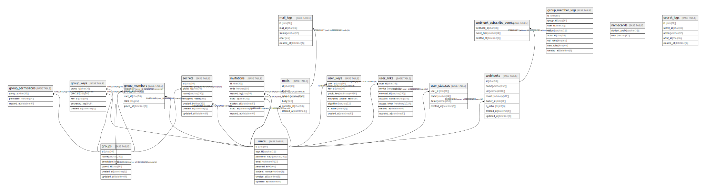

# portal

## Tables

| Name | Columns | Comment | Type |
| ---- | ------- | ------- | ---- |
| [groups](groups.md) | 6 |  | BASE TABLE |
| [group_keys](group_keys.md) | 5 |  | BASE TABLE |
| [group_members](group_members.md) | 4 |  | BASE TABLE |
| [group_member_logs](group_member_logs.md) | 8 |  | BASE TABLE |
| [group_permissions](group_permissions.md) | 3 |  | BASE TABLE |
| [invitations](invitations.md) | 7 |  | BASE TABLE |
| [mails](mails.md) | 6 |  | BASE TABLE |
| [mail_logs](mail_logs.md) | 5 |  | BASE TABLE |
| [namecards](namecards.md) | 2 |  | BASE TABLE |
| [secrets](secrets.md) | 7 |  | BASE TABLE |
| [secret_logs](secret_logs.md) | 5 |  | BASE TABLE |
| [users](users.md) | 8 |  | BASE TABLE |
| [user_keys](user_keys.md) | 7 |  | BASE TABLE |
| [user_links](user_links.md) | 7 |  | BASE TABLE |
| [user_statuses](user_statuses.md) | 4 |  | BASE TABLE |
| [webhooks](webhooks.md) | 8 |  | BASE TABLE |
| [webhook_subscribe_events](webhook_subscribe_events.md) | 3 |  | BASE TABLE |

## Relations

---

> Generated by [tbls](https://github.com/k1LoW/tbls)
