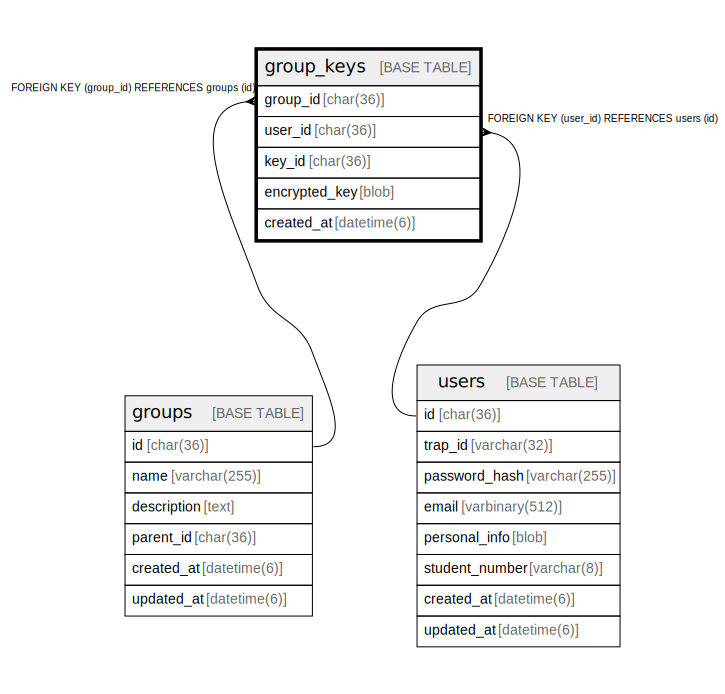

# group_keys

## Description

<details>
<summary><strong>Table Definition</strong></summary>

```sql
CREATE TABLE `group_keys` (
  `group_id` char(36) NOT NULL,
  `user_id` char(36) NOT NULL,
  `key_id` char(36) NOT NULL COMMENT 'UUID v4',
  `encrypted_key` blob NOT NULL COMMENT 'Group symmetric key encrypted with user public key',
  `created_at` datetime(6) NOT NULL DEFAULT current_timestamp(6),
  PRIMARY KEY (`group_id`,`user_id`,`key_id`),
  KEY `fk_group_keys_user` (`user_id`),
  CONSTRAINT `fk_group_keys_group` FOREIGN KEY (`group_id`) REFERENCES `groups` (`id`) ON DELETE CASCADE ON UPDATE CASCADE,
  CONSTRAINT `fk_group_keys_user` FOREIGN KEY (`user_id`) REFERENCES `users` (`id`) ON DELETE CASCADE ON UPDATE CASCADE
) ENGINE=InnoDB DEFAULT CHARSET=utf8mb4 COLLATE=utf8mb4_general_ci
```

</details>

## Columns

| Name | Type | Default | Nullable | Children | Parents | Comment |
| ---- | ---- | ------- | -------- | -------- | ------- | ------- |
| group_id | char(36) |  | false |  | [groups](groups.md) |  |
| user_id | char(36) |  | false |  | [users](users.md) |  |
| key_id | char(36) |  | false |  |  | UUID v4 |
| encrypted_key | blob |  | false |  |  | Group symmetric key encrypted with user public key |
| created_at | datetime(6) | current_timestamp(6) | false |  |  |  |

## Constraints

| Name | Type | Definition |
| ---- | ---- | ---------- |
| fk_group_keys_group | FOREIGN KEY | FOREIGN KEY (group_id) REFERENCES groups (id) |
| fk_group_keys_user | FOREIGN KEY | FOREIGN KEY (user_id) REFERENCES users (id) |
| PRIMARY | PRIMARY KEY | PRIMARY KEY (group_id, user_id, key_id) |

## Indexes

| Name | Definition |
| ---- | ---------- |
| fk_group_keys_user | KEY fk_group_keys_user (user_id) USING BTREE |
| PRIMARY | PRIMARY KEY (group_id, user_id, key_id) USING BTREE |

## Relations



---

> Generated by [tbls](https://github.com/k1LoW/tbls)
