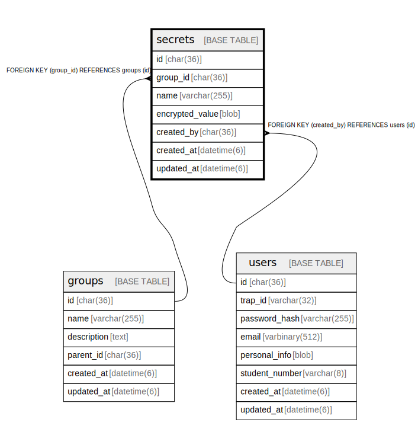

# secrets

## Description

<details>
<summary><strong>Table Definition</strong></summary>

```sql
CREATE TABLE `secrets` (
  `id` char(36) NOT NULL COMMENT 'UUID v4',
  `group_id` char(36) NOT NULL COMMENT 'Owning group',
  `name` varchar(255) NOT NULL,
  `encrypted_value` blob NOT NULL COMMENT 'AES-GCM encrypted with group key',
  `created_by` char(36) DEFAULT NULL,
  `created_at` datetime(6) NOT NULL DEFAULT current_timestamp(6),
  `updated_at` datetime(6) NOT NULL DEFAULT current_timestamp(6) ON UPDATE current_timestamp(6),
  PRIMARY KEY (`id`),
  KEY `fk_secrets_created_by` (`created_by`),
  KEY `idx_secrets_group` (`group_id`),
  CONSTRAINT `fk_secrets_created_by` FOREIGN KEY (`created_by`) REFERENCES `users` (`id`) ON DELETE SET NULL ON UPDATE CASCADE,
  CONSTRAINT `fk_secrets_group` FOREIGN KEY (`group_id`) REFERENCES `groups` (`id`) ON DELETE CASCADE ON UPDATE CASCADE
) ENGINE=InnoDB DEFAULT CHARSET=utf8mb4 COLLATE=utf8mb4_general_ci
```

</details>

## Columns

| Name | Type | Default | Nullable | Extra Definition | Children | Parents | Comment |
| ---- | ---- | ------- | -------- | ---------------- | -------- | ------- | ------- |
| id | char(36) |  | false |  |  |  | UUID v4 |
| group_id | char(36) |  | false |  |  | [groups](groups.md) | Owning group |
| name | varchar(255) |  | false |  |  |  |  |
| encrypted_value | blob |  | false |  |  |  | AES-GCM encrypted with group key |
| created_by | char(36) | NULL | true |  |  | [users](users.md) |  |
| created_at | datetime(6) | current_timestamp(6) | false |  |  |  |  |
| updated_at | datetime(6) | current_timestamp(6) | false | on update current_timestamp(6) |  |  |  |

## Constraints

| Name | Type | Definition |
| ---- | ---- | ---------- |
| fk_secrets_created_by | FOREIGN KEY | FOREIGN KEY (created_by) REFERENCES users (id) |
| fk_secrets_group | FOREIGN KEY | FOREIGN KEY (group_id) REFERENCES groups (id) |
| PRIMARY | PRIMARY KEY | PRIMARY KEY (id) |

## Indexes

| Name | Definition |
| ---- | ---------- |
| fk_secrets_created_by | KEY fk_secrets_created_by (created_by) USING BTREE |
| idx_secrets_group | KEY idx_secrets_group (group_id) USING BTREE |
| PRIMARY | PRIMARY KEY (id) USING BTREE |

## Relations



---

> Generated by [tbls](https://github.com/k1LoW/tbls)
