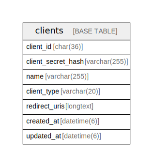

# oidc

## Description

OAuth 2.1 / OpenID Connect Provider for traP SSO.  
traP の各サービス (traQ, knoQ, NeoShowcase 等) への SSO 基盤を提供する。  

## Tables

| Name | Columns | Comment | Type | Labels |
| ---- | ------- | ------- | ---- | ------ |
| [clients](clients.md) | 7 | OAuth 2.1 / OIDC クライアントテーブル。 各サービスは Client Credentials または Authorization Code フローでトークンを取得し、 ユーザーの所属グループ情報等を取得できる。  | BASE TABLE | `OAuth2/OIDC` |

## Relations

---

> Generated by [tbls](https://github.com/k1LoW/tbls)
