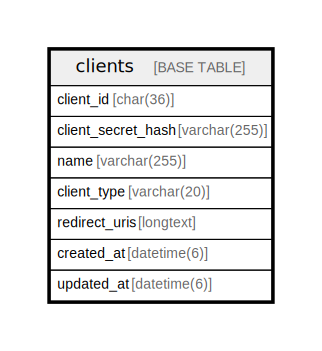

# clients

## Description

OAuth 2.1 / OIDC クライアントテーブル。  
各サービスは Client Credentials または Authorization Code フローでトークンを取得し、  
ユーザーの所属グループ情報等を取得できる。  


<details>
<summary><strong>Table Definition</strong></summary>

```sql
CREATE TABLE `clients` (
  `client_id` char(36) NOT NULL,
  `client_secret_hash` varchar(255) DEFAULT NULL,
  `name` varchar(255) NOT NULL,
  `client_type` varchar(20) NOT NULL,
  `redirect_uris` longtext CHARACTER SET utf8mb4 COLLATE utf8mb4_bin NOT NULL CHECK (json_valid(`redirect_uris`)),
  `created_at` datetime(6) NOT NULL DEFAULT current_timestamp(6),
  `updated_at` datetime(6) NOT NULL DEFAULT current_timestamp(6) ON UPDATE current_timestamp(6),
  PRIMARY KEY (`client_id`)
) ENGINE=InnoDB DEFAULT CHARSET=utf8mb4 COLLATE=utf8mb4_general_ci
```

</details>

## Labels

`OAuth2/OIDC`

## Columns

| Name | Type | Default | Nullable | Extra Definition | Children | Parents | Comment |
| ---- | ---- | ------- | -------- | ---------------- | -------- | ------- | ------- |
| client_id | char(36) |  | false |  |  |  | クライアントUUID (RFC 7591準拠) |
| client_secret_hash | varchar(255) | NULL | true |  |  |  | ハッシュ化されたクライアントシークレット (confidential client用、public clientはNULL) |
| name | varchar(255) |  | false |  |  |  | クライアント名 (traQ, knoQ, NeoShowcase等) |
| client_type | varchar(20) |  | false |  |  |  | クライアントタイプ:<br />- public: SPA等のシークレットを安全に保持できないクライアント<br />- confidential: サーバーサイドでシークレットを保持できるクライアント<br /> |
| redirect_uris | longtext |  | false |  |  |  | OAuth認可後のリダイレクトURI (JSON配列、複数環境対応) |
| created_at | datetime(6) | current_timestamp(6) | false |  |  |  | 作成日時 |
| updated_at | datetime(6) | current_timestamp(6) | false | on update current_timestamp(6) |  |  | 更新日時 |

## Constraints

| Name | Type | Definition | Comment |
| ---- | ---- | ---------- | ------- |
| PRIMARY | PRIMARY KEY | PRIMARY KEY (client_id) | 主キー |
| redirect_uris | CHECK | CHECK (json_valid(`redirect_uris`)) | JSONバリデーション |

## Indexes

| Name | Definition | Comment |
| ---- | ---------- | ------- |
| PRIMARY | PRIMARY KEY (client_id) USING BTREE | 主キー |

## Relations



---

> Generated by [tbls](https://github.com/k1LoW/tbls)
