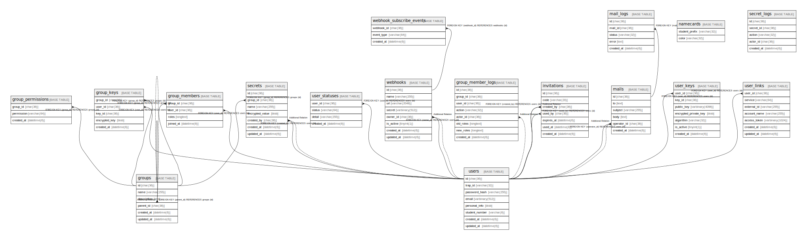

# portal

## Description

traPortal v2 - traP 部員管理システム。  
ユーザー管理、グループ機能、シークレット管理、メール送受信、Webhook連携を提供する。  

## Tables

| Name | Columns | Comment | Type | Labels |
| ---- | ------- | ------- | ---- | ------ |
| [groups](groups.md) | 6 | グループテーブル。 行動を共にする集団を表現。traQ, knoQ, traPortal で統一されたグループ機能を提供。 通常グループ (管理者あり) と公開グループ (自由参加) の2種類がある。  | BASE TABLE | `グループ機能` |
| [group_keys](group_keys.md) | 5 | グループ暗号鍵テーブル (E2E暗号化用)。 グループ対称鍵を各メンバーの公開鍵で暗号化して保存。 メンバー全員がパスワードを忘れるとシークレットは復号不可。  | BASE TABLE | `グループ機能` |
| [group_members](group_members.md) | 4 | グループメンバーテーブル。 グループに所属するユーザーとそのロールを管理。  | BASE TABLE | `グループ機能` |
| [group_member_logs](group_member_logs.md) | 8 | グループメンバー変更ログテーブル。 卒業時の属人化防止と監査のため、メンバー変更履歴を記録。  | BASE TABLE | `グループ機能` |
| [group_permissions](group_permissions.md) | 3 | グループ権限テーブル。 グループに権限を付与し、OAuth認可時にclaimできる。 例: 庶務→ユーザー個人情報閲覧/編集、サービス管理者→admin権限  | BASE TABLE | `グループ機能` |
| [invitations](invitations.md) | 7 | 招待コードテーブル。 新入生やex-traP移行用の登録招待コードを管理。  | BASE TABLE | `ユーザー管理` |
| [mails](mails.md) | 6 | 送信メールテーブル。 SendGrid経由で複数人に同時にメールを送信。庶務・渉外が利用。  | BASE TABLE | `メール送受信` |
| [mail_logs](mail_logs.md) | 5 | メール送信ログテーブル。 SendGridからの送信結果を記録。  | BASE TABLE | `メール送受信` |
| [namecards](namecards.md) | 2 | 名札色設定テーブル。 学年ごとの名札色を管理。  | BASE TABLE | `その他` |
| [secrets](secrets.md) | 7 | シークレットテーブル (E2E暗号化)。 プロジェクトで使用する共用アカウント (Twitter, GitHub等) のパスワードやAPIキーを、 現在のグループメンバーだけが閲覧できるように暗号化して保存。 DB漏洩してもサーバー運用者でも閲覧不可。  | BASE TABLE | `シークレット管理` |
| [secret_logs](secret_logs.md) | 5 | シークレット操作ログテーブル。 監査とセキュリティのため、シークレットへのアクセス履歴を記録。  | BASE TABLE | `シークレット管理` |
| [users](users.md) | 8 | ユーザーテーブル。 traP 部員のアカウントと個人情報を管理する。 個人情報は高度な暗号化 (AES-256) で保護され、DB漏洩時も閲覧不可。  | BASE TABLE | `ユーザー管理` |
| [user_keys](user_keys.md) | 7 | ユーザー暗号鍵テーブル (E2E暗号化用)。 Password → Master Key → Symmetric Key → Private Key の鍵階層で管理。 Master Key はサーバーに送信されない。  | BASE TABLE | `ユーザー管理` |
| [user_links](user_links.md) | 7 | ユーザー外部サービス連携テーブル。 Twitter, GitHub, Discord等の外部アカウントと連携。  | BASE TABLE | `ユーザー管理` |
| [user_statuses](user_statuses.md) | 4 | ユーザーステータステーブル。 会員期限管理により凍結処理を自動化。支払うと年度末までのアカウント使用権が与えられる。  | BASE TABLE | `ユーザー管理` |
| [webhooks](webhooks.md) | 8 | Webhookテーブル。 traPortal内データの変更イベントを各サービスに通知。 グループメンバー変更時にtraQやknoQに自動同期。  | BASE TABLE | `Webhook連携` |
| [webhook_subscribe_events](webhook_subscribe_events.md) | 3 | Webhook購読イベントテーブル。 各Webhookが購読するイベントタイプを管理。  | BASE TABLE | `Webhook連携` |

## Relations

---

> Generated by [tbls](https://github.com/k1LoW/tbls)
