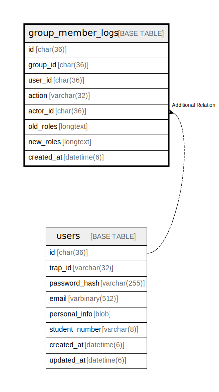

# group_member_logs

## Description

グループメンバー変更ログテーブル。  
卒業時の属人化防止と監査のため、メンバー変更履歴を記録。  


<details>
<summary><strong>Table Definition</strong></summary>

```sql
CREATE TABLE `group_member_logs` (
  `id` char(36) NOT NULL COMMENT 'UUID v4',
  `group_id` char(36) NOT NULL,
  `user_id` char(36) NOT NULL,
  `action` varchar(32) NOT NULL COMMENT 'Action: added, removed, role_changed',
  `actor_id` char(36) DEFAULT NULL COMMENT 'User who performed the action',
  `old_roles` longtext CHARACTER SET utf8mb4 COLLATE utf8mb4_bin DEFAULT NULL CHECK (json_valid(`old_roles`)),
  `new_roles` longtext CHARACTER SET utf8mb4 COLLATE utf8mb4_bin DEFAULT NULL CHECK (json_valid(`new_roles`)),
  `created_at` datetime(6) NOT NULL DEFAULT current_timestamp(6),
  PRIMARY KEY (`id`),
  KEY `idx_group_member_logs_group` (`group_id`),
  KEY `idx_group_member_logs_user` (`user_id`)
) ENGINE=InnoDB DEFAULT CHARSET=utf8mb4 COLLATE=utf8mb4_general_ci
```

</details>

## Labels

`グループ機能`

## Columns

| Name | Type | Default | Nullable | Children | Parents | Comment |
| ---- | ---- | ------- | -------- | -------- | ------- | ------- |
| id | char(36) |  | false |  |  | ログUUID |
| group_id | char(36) |  | false |  |  | グループUUID |
| user_id | char(36) |  | false |  |  | 対象ユーザーUUID |
| action | varchar(32) |  | false |  |  | アクション (added, removed, role_changed) |
| actor_id | char(36) | NULL | true |  | [users](users.md) | 操作者UUID |
| old_roles | longtext | NULL | true |  |  | 変更前ロール |
| new_roles | longtext | NULL | true |  |  | 変更後ロール |
| created_at | datetime(6) | current_timestamp(6) | false |  |  | 作成日時 |

## Constraints

| Name | Type | Definition | Comment |
| ---- | ---- | ---------- | ------- |
| PRIMARY | PRIMARY KEY | PRIMARY KEY (id) | 主キー |
| old_roles | CHECK | CHECK (json_valid(`old_roles`)) | JSONバリデーション |
| new_roles | CHECK | CHECK (json_valid(`new_roles`)) | JSONバリデーション |

## Indexes

| Name | Definition | Comment |
| ---- | ---------- | ------- |
| idx_group_member_logs_group | KEY idx_group_member_logs_group (group_id) USING BTREE | グループインデックス |
| idx_group_member_logs_user | KEY idx_group_member_logs_user (user_id) USING BTREE | ユーザーインデックス |
| PRIMARY | PRIMARY KEY (id) USING BTREE | 主キー |

## Relations



---

> Generated by [tbls](https://github.com/k1LoW/tbls)
