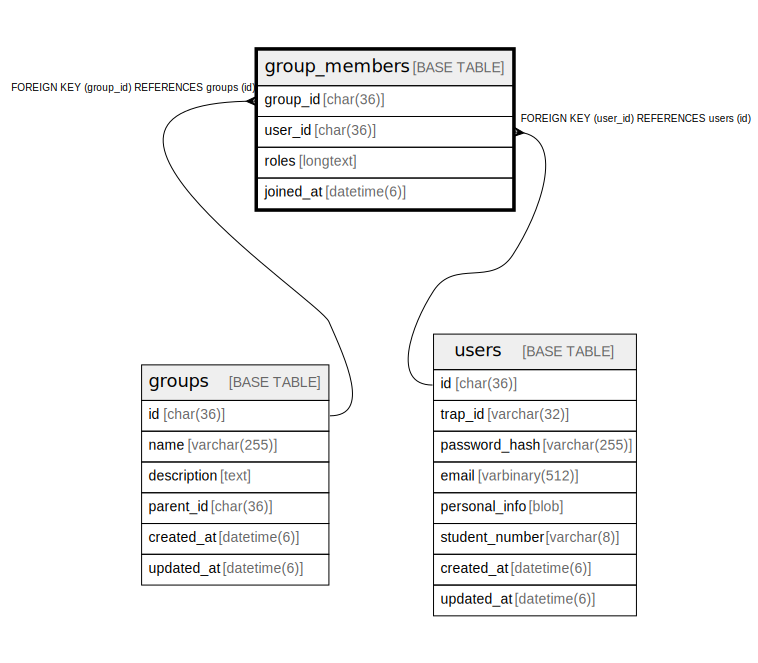

# group_members

## Description

グループメンバーテーブル。  
グループに所属するユーザーとそのロールを管理。  


<details>
<summary><strong>Table Definition</strong></summary>

```sql
CREATE TABLE `group_members` (
  `group_id` char(36) NOT NULL,
  `user_id` char(36) NOT NULL,
  `roles` longtext CHARACTER SET utf8mb4 COLLATE utf8mb4_bin NOT NULL DEFAULT '[]' COMMENT 'Member roles within group: ["admin", "owner", "member"]' CHECK (json_valid(`roles`)),
  `joined_at` datetime(6) NOT NULL DEFAULT current_timestamp(6),
  PRIMARY KEY (`group_id`,`user_id`),
  KEY `fk_group_members_user` (`user_id`),
  CONSTRAINT `fk_group_members_group` FOREIGN KEY (`group_id`) REFERENCES `groups` (`id`) ON DELETE CASCADE ON UPDATE CASCADE,
  CONSTRAINT `fk_group_members_user` FOREIGN KEY (`user_id`) REFERENCES `users` (`id`) ON DELETE CASCADE ON UPDATE CASCADE
) ENGINE=InnoDB DEFAULT CHARSET=utf8mb4 COLLATE=utf8mb4_general_ci
```

</details>

## Labels

`グループ機能`

## Columns

| Name | Type | Default | Nullable | Children | Parents | Comment |
| ---- | ---- | ------- | -------- | -------- | ------- | ------- |
| group_id | char(36) |  | false |  | [groups](groups.md) | グループUUID |
| user_id | char(36) |  | false |  | [users](users.md) | ユーザーUUID (メンション対象) |
| roles | longtext | '[]' | false |  |  | メンバーロール (JSON配列):<br />- role_assign: ロール付与権限 (実質管理者)<br />- member_edit: メンバー追加/削除権限<br />- group_edit: グループ名/説明編集権限<br />- group_delete: グループ削除権限<br />- secret_edit: シークレット編集権限<br /> |
| joined_at | datetime(6) | current_timestamp(6) | false |  |  | 参加日時 |

## Constraints

| Name | Type | Definition | Comment |
| ---- | ---- | ---------- | ------- |
| fk_group_members_group | FOREIGN KEY | FOREIGN KEY (group_id) REFERENCES groups (id) | グループ外部キー |
| fk_group_members_user | FOREIGN KEY | FOREIGN KEY (user_id) REFERENCES users (id) | ユーザー外部キー |
| PRIMARY | PRIMARY KEY | PRIMARY KEY (group_id, user_id) | 主キー |
| roles | CHECK | CHECK (json_valid(`roles`)) | JSONバリデーション |

## Indexes

| Name | Definition | Comment |
| ---- | ---------- | ------- |
| fk_group_members_user | KEY fk_group_members_user (user_id) USING BTREE | ユーザーインデックス |
| PRIMARY | PRIMARY KEY (group_id, user_id) USING BTREE | 主キー |

## Relations



---

> Generated by [tbls](https://github.com/k1LoW/tbls)
