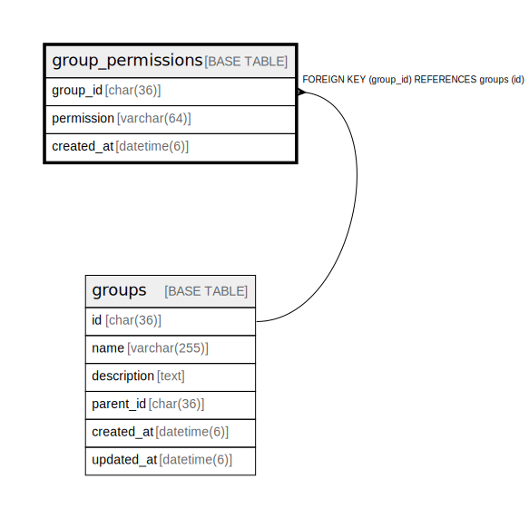

# group_permissions

## Description

グループ権限テーブル。  
グループに権限を付与し、OAuth認可時にclaimできる。  
例: 庶務→ユーザー個人情報閲覧/編集、サービス管理者→admin権限  


<details>
<summary><strong>Table Definition</strong></summary>

```sql
CREATE TABLE `group_permissions` (
  `group_id` char(36) NOT NULL,
  `permission` varchar(64) NOT NULL COMMENT 'Permission: user:read, user:update, invitation:create, etc.',
  `created_at` datetime(6) NOT NULL DEFAULT current_timestamp(6),
  PRIMARY KEY (`group_id`,`permission`),
  CONSTRAINT `fk_group_permissions_group` FOREIGN KEY (`group_id`) REFERENCES `groups` (`id`) ON DELETE CASCADE ON UPDATE CASCADE
) ENGINE=InnoDB DEFAULT CHARSET=utf8mb4 COLLATE=utf8mb4_general_ci
```

</details>

## Labels

`グループ機能`

## Columns

| Name | Type | Default | Nullable | Children | Parents | Comment |
| ---- | ---- | ------- | -------- | -------- | ------- | ------- |
| group_id | char(36) |  | false |  | [groups](groups.md) | グループUUID |
| permission | varchar(64) |  | false |  |  | 権限 (例):<br />- user:read, user:write: ユーザー情報<br />- invitation:create: 招待コード発行<br />- mail:send: メール送信<br />- admin:*: 管理者権限<br /> |
| created_at | datetime(6) | current_timestamp(6) | false |  |  | 作成日時 |

## Constraints

| Name | Type | Definition | Comment |
| ---- | ---- | ---------- | ------- |
| fk_group_permissions_group | FOREIGN KEY | FOREIGN KEY (group_id) REFERENCES groups (id) | グループ外部キー |
| PRIMARY | PRIMARY KEY | PRIMARY KEY (group_id, permission) | 主キー |

## Indexes

| Name | Definition | Comment |
| ---- | ---------- | ------- |
| PRIMARY | PRIMARY KEY (group_id, permission) USING BTREE | 主キー |

## Relations



---

> Generated by [tbls](https://github.com/k1LoW/tbls)
