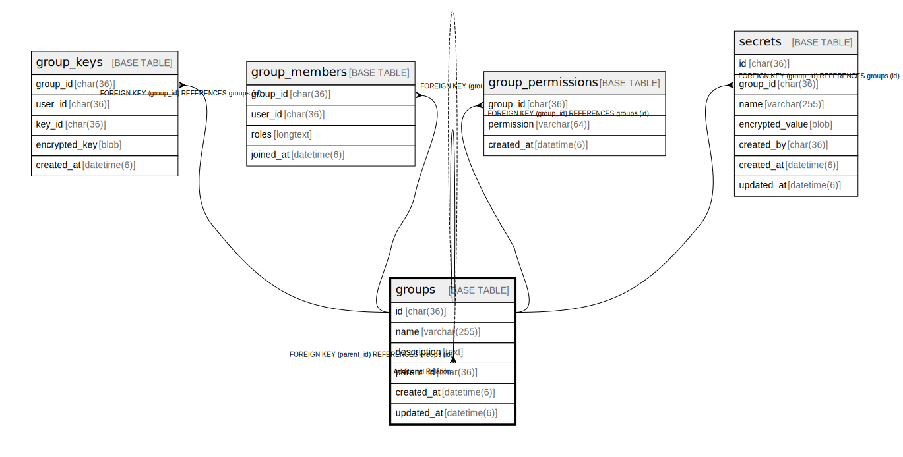

# groups

## Description

グループテーブル。  
行動を共にする集団を表現。traQ, knoQ, traPortal で統一されたグループ機能を提供。  
通常グループ (管理者あり) と公開グループ (自由参加) の2種類がある。  


<details>
<summary><strong>Table Definition</strong></summary>

```sql
CREATE TABLE `groups` (
  `id` char(36) NOT NULL COMMENT 'UUID v4',
  `name` varchar(255) NOT NULL,
  `description` text DEFAULT NULL,
  `parent_id` char(36) DEFAULT NULL COMMENT 'Parent group for hierarchical structure',
  `created_at` datetime(6) NOT NULL DEFAULT current_timestamp(6),
  `updated_at` datetime(6) NOT NULL DEFAULT current_timestamp(6) ON UPDATE current_timestamp(6),
  PRIMARY KEY (`id`),
  KEY `fk_groups_parent` (`parent_id`),
  CONSTRAINT `fk_groups_parent` FOREIGN KEY (`parent_id`) REFERENCES `groups` (`id`) ON DELETE SET NULL ON UPDATE CASCADE
) ENGINE=InnoDB DEFAULT CHARSET=utf8mb4 COLLATE=utf8mb4_general_ci
```

</details>

## Labels

`グループ機能`

## Columns

| Name | Type | Default | Nullable | Extra Definition | Children | Parents | Comment |
| ---- | ---- | ------- | -------- | ---------------- | -------- | ------- | ------- |
| id | char(36) |  | false |  | [groups](groups.md) [group_keys](group_keys.md) [group_members](group_members.md) [group_permissions](group_permissions.md) [secrets](secrets.md) |  | グループUUID |
| name | varchar(255) |  | false |  |  |  | グループ名 (メンション対象) |
| description | text | NULL | true |  |  |  | グループ説明 |
| parent_id | char(36) | NULL | true |  |  | [groups](groups.md) | 親グループUUID (階層構造用) |
| created_at | datetime(6) | current_timestamp(6) | false |  |  |  | 作成日時 |
| updated_at | datetime(6) | current_timestamp(6) | false | on update current_timestamp(6) |  |  | 更新日時 |

## Constraints

| Name | Type | Definition | Comment |
| ---- | ---- | ---------- | ------- |
| fk_groups_parent | FOREIGN KEY | FOREIGN KEY (parent_id) REFERENCES groups (id) | 親グループ外部キー |
| PRIMARY | PRIMARY KEY | PRIMARY KEY (id) | 主キー |

## Indexes

| Name | Definition | Comment |
| ---- | ---------- | ------- |
| fk_groups_parent | KEY fk_groups_parent (parent_id) USING BTREE | 親グループインデックス |
| PRIMARY | PRIMARY KEY (id) USING BTREE | 主キー |

## Relations



---

> Generated by [tbls](https://github.com/k1LoW/tbls)
