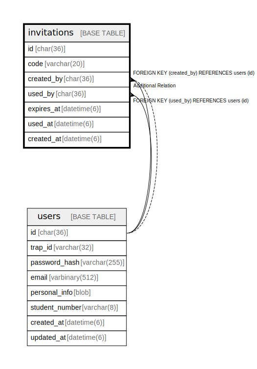

# invitations

## Description

招待コードテーブル。  
新入生やex-traP移行用の登録招待コードを管理。  


<details>
<summary><strong>Table Definition</strong></summary>

```sql
CREATE TABLE `invitations` (
  `id` char(36) NOT NULL COMMENT 'UUID v4',
  `code` varchar(20) NOT NULL COMMENT 'Invitation code (e.g., XXXX-XXXX-XXXX)',
  `created_by` char(36) DEFAULT NULL COMMENT 'User who created this invitation',
  `used_by` char(36) DEFAULT NULL COMMENT 'User who used this invitation',
  `expires_at` datetime(6) DEFAULT NULL COMMENT 'Expiration time (NULL = never expires)',
  `used_at` datetime(6) DEFAULT NULL,
  `created_at` datetime(6) NOT NULL DEFAULT current_timestamp(6),
  PRIMARY KEY (`id`),
  UNIQUE KEY `uq_invitations_code` (`code`),
  KEY `fk_invitations_created_by` (`created_by`),
  KEY `fk_invitations_used_by` (`used_by`),
  CONSTRAINT `fk_invitations_created_by` FOREIGN KEY (`created_by`) REFERENCES `users` (`id`) ON DELETE SET NULL ON UPDATE CASCADE,
  CONSTRAINT `fk_invitations_used_by` FOREIGN KEY (`used_by`) REFERENCES `users` (`id`) ON DELETE SET NULL ON UPDATE CASCADE
) ENGINE=InnoDB DEFAULT CHARSET=utf8mb4 COLLATE=utf8mb4_general_ci
```

</details>

## Labels

`ユーザー管理`

## Columns

| Name | Type | Default | Nullable | Children | Parents | Comment |
| ---- | ---- | ------- | -------- | -------- | ------- | ------- |
| id | char(36) |  | false |  |  | 招待UUID |
| code | varchar(20) |  | false |  |  | 招待コード (署名付きURL用) |
| created_by | char(36) | NULL | true |  | [users](users.md) | 作成者UUID (庶務) |
| used_by | char(36) | NULL | true |  | [users](users.md) | 使用者UUID |
| expires_at | datetime(6) | NULL | true |  |  | 有効期限 |
| used_at | datetime(6) | NULL | true |  |  | 使用日時 |
| created_at | datetime(6) | current_timestamp(6) | false |  |  | 作成日時 |

## Constraints

| Name | Type | Definition | Comment |
| ---- | ---- | ---------- | ------- |
| fk_invitations_created_by | FOREIGN KEY | FOREIGN KEY (created_by) REFERENCES users (id) | 作成者外部キー |
| fk_invitations_used_by | FOREIGN KEY | FOREIGN KEY (used_by) REFERENCES users (id) | 使用者外部キー |
| PRIMARY | PRIMARY KEY | PRIMARY KEY (id) | 主キー |
| uq_invitations_code | UNIQUE | UNIQUE KEY uq_invitations_code (code) | 招待コードユニーク制約 |

## Indexes

| Name | Definition | Comment |
| ---- | ---------- | ------- |
| fk_invitations_created_by | KEY fk_invitations_created_by (created_by) USING BTREE | 作成者インデックス |
| fk_invitations_used_by | KEY fk_invitations_used_by (used_by) USING BTREE | 使用者インデックス |
| PRIMARY | PRIMARY KEY (id) USING BTREE | 主キー |
| uq_invitations_code | UNIQUE KEY uq_invitations_code (code) USING BTREE | 招待コードユニーク制約 |

## Relations



---

> Generated by [tbls](https://github.com/k1LoW/tbls)
