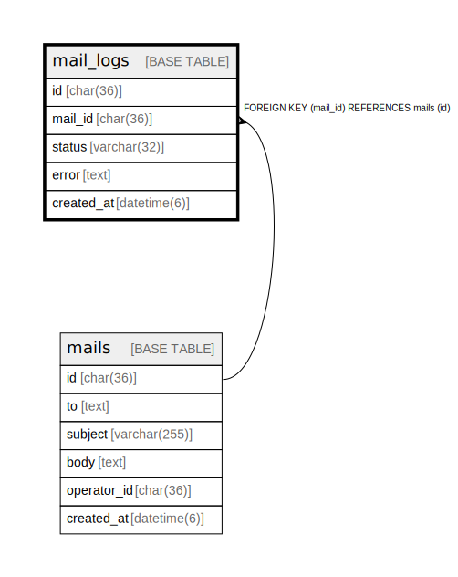

# mail_logs

## Description

メール送信ログテーブル。  
SendGridからの送信結果を記録。  


<details>
<summary><strong>Table Definition</strong></summary>

```sql
CREATE TABLE `mail_logs` (
  `id` char(36) NOT NULL COMMENT 'UUID v4',
  `mail_id` char(36) NOT NULL,
  `status` varchar(32) NOT NULL COMMENT 'Status: unsent, sent, failed',
  `error` text DEFAULT NULL,
  `created_at` datetime(6) NOT NULL DEFAULT current_timestamp(6),
  PRIMARY KEY (`id`),
  KEY `idx_mail_logs_mail` (`mail_id`),
  CONSTRAINT `fk_mail_logs_mail` FOREIGN KEY (`mail_id`) REFERENCES `mails` (`id`) ON DELETE CASCADE ON UPDATE CASCADE
) ENGINE=InnoDB DEFAULT CHARSET=utf8mb4 COLLATE=utf8mb4_general_ci
```

</details>

## Labels

`メール送受信`

## Columns

| Name | Type | Default | Nullable | Children | Parents | Comment |
| ---- | ---- | ------- | -------- | -------- | ------- | ------- |
| id | char(36) |  | false |  |  | ログUUID |
| mail_id | char(36) |  | false |  | [mails](mails.md) | メールUUID |
| status | varchar(32) |  | false |  |  | ステータス (unsent, sent, failed) |
| error | text | NULL | true |  |  | エラー内容 (failed時) |
| created_at | datetime(6) | current_timestamp(6) | false |  |  | 作成日時 |

## Constraints

| Name | Type | Definition | Comment |
| ---- | ---- | ---------- | ------- |
| fk_mail_logs_mail | FOREIGN KEY | FOREIGN KEY (mail_id) REFERENCES mails (id) | メール外部キー |
| PRIMARY | PRIMARY KEY | PRIMARY KEY (id) | 主キー |

## Indexes

| Name | Definition | Comment |
| ---- | ---------- | ------- |
| idx_mail_logs_mail | KEY idx_mail_logs_mail (mail_id) USING BTREE | メールインデックス |
| PRIMARY | PRIMARY KEY (id) USING BTREE | 主キー |

## Relations



---

> Generated by [tbls](https://github.com/k1LoW/tbls)
