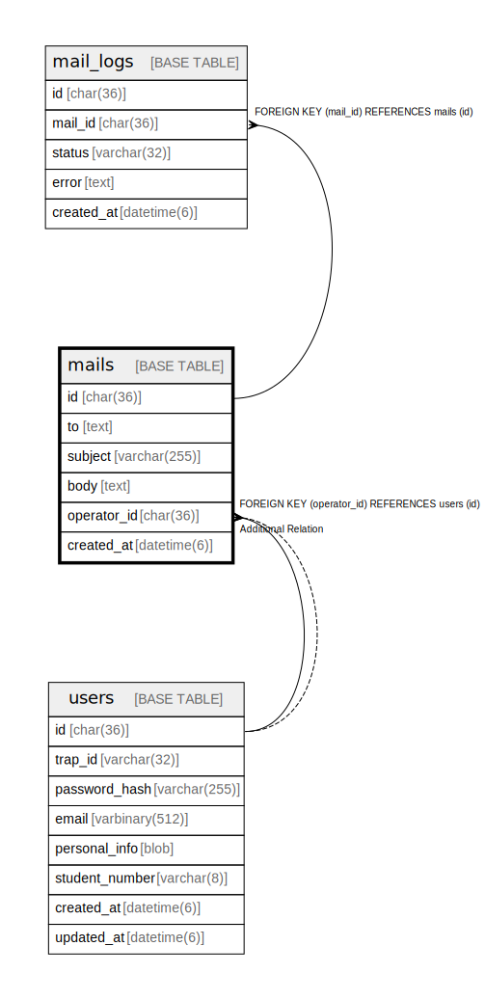

# mails

## Description

送信メールテーブル。  
SendGrid経由で複数人に同時にメールを送信。庶務・渉外が利用。  


<details>
<summary><strong>Table Definition</strong></summary>

```sql
CREATE TABLE `mails` (
  `id` char(36) NOT NULL COMMENT 'UUID v4',
  `to` text DEFAULT NULL COMMENT 'Recipients (format: @trap_id;@trap_id2)',
  `subject` varchar(255) DEFAULT NULL,
  `body` text DEFAULT NULL,
  `operator_id` char(36) DEFAULT NULL COMMENT 'User who sent this mail',
  `created_at` datetime(6) NOT NULL DEFAULT current_timestamp(6),
  PRIMARY KEY (`id`),
  KEY `fk_mails_operator` (`operator_id`),
  CONSTRAINT `fk_mails_operator` FOREIGN KEY (`operator_id`) REFERENCES `users` (`id`) ON DELETE SET NULL ON UPDATE CASCADE
) ENGINE=InnoDB DEFAULT CHARSET=utf8mb4 COLLATE=utf8mb4_general_ci
```

</details>

## Labels

`メール送受信`

## Columns

| Name | Type | Default | Nullable | Children | Parents | Comment |
| ---- | ---- | ------- | -------- | -------- | ------- | ------- |
| id | char(36) |  | false | [mail_logs](mail_logs.md) |  | メールUUID |
| to | text | NULL | true |  |  | 宛先 (@trap_id形式、複数可) |
| subject | varchar(255) | NULL | true |  |  | 件名 |
| body | text | NULL | true |  |  | 本文 |
| operator_id | char(36) | NULL | true |  | [users](users.md) | 送信者UUID (庶務/渉外) |
| created_at | datetime(6) | current_timestamp(6) | false |  |  | 作成日時 |

## Constraints

| Name | Type | Definition | Comment |
| ---- | ---- | ---------- | ------- |
| fk_mails_operator | FOREIGN KEY | FOREIGN KEY (operator_id) REFERENCES users (id) | 送信者外部キー |
| PRIMARY | PRIMARY KEY | PRIMARY KEY (id) | 主キー |

## Indexes

| Name | Definition | Comment |
| ---- | ---------- | ------- |
| fk_mails_operator | KEY fk_mails_operator (operator_id) USING BTREE | 送信者インデックス |
| PRIMARY | PRIMARY KEY (id) USING BTREE | 主キー |

## Relations



---

> Generated by [tbls](https://github.com/k1LoW/tbls)
