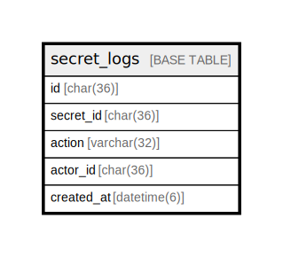

# secret_logs

## Description

シークレット操作ログテーブル。  
監査とセキュリティのため、シークレットへのアクセス履歴を記録。  


<details>
<summary><strong>Table Definition</strong></summary>

```sql
CREATE TABLE `secret_logs` (
  `id` char(36) NOT NULL COMMENT 'UUID v4',
  `secret_id` char(36) NOT NULL,
  `action` varchar(32) NOT NULL COMMENT 'Action: created, updated, deleted, accessed',
  `actor_id` char(36) DEFAULT NULL,
  `created_at` datetime(6) NOT NULL DEFAULT current_timestamp(6),
  PRIMARY KEY (`id`),
  KEY `idx_secret_logs_secret` (`secret_id`)
) ENGINE=InnoDB DEFAULT CHARSET=utf8mb4 COLLATE=utf8mb4_general_ci
```

</details>

## Labels

`シークレット管理`

## Columns

| Name | Type | Default | Nullable | Children | Parents | Comment |
| ---- | ---- | ------- | -------- | -------- | ------- | ------- |
| id | char(36) |  | false |  |  | ログUUID |
| secret_id | char(36) |  | false |  |  | シークレットUUID |
| action | varchar(32) |  | false |  |  | アクション (created, updated, deleted, accessed) |
| actor_id | char(36) | NULL | true |  |  | 操作者UUID |
| created_at | datetime(6) | current_timestamp(6) | false |  |  | 作成日時 |

## Constraints

| Name | Type | Definition | Comment |
| ---- | ---- | ---------- | ------- |
| PRIMARY | PRIMARY KEY | PRIMARY KEY (id) | 主キー |

## Indexes

| Name | Definition | Comment |
| ---- | ---------- | ------- |
| idx_secret_logs_secret | KEY idx_secret_logs_secret (secret_id) USING BTREE | シークレットインデックス |
| PRIMARY | PRIMARY KEY (id) USING BTREE | 主キー |

## Relations



---

> Generated by [tbls](https://github.com/k1LoW/tbls)
