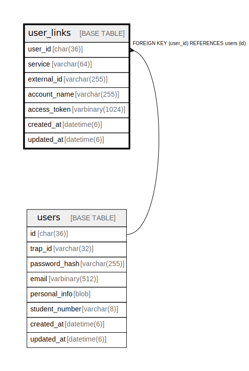

# user_links

## Description

ユーザー外部サービス連携テーブル。  
Twitter, GitHub, Discord等の外部アカウントと連携。  


<details>
<summary><strong>Table Definition</strong></summary>

```sql
CREATE TABLE `user_links` (
  `user_id` char(36) NOT NULL,
  `service` varchar(64) NOT NULL COMMENT 'Service name: twitter, github, discord, etc.',
  `external_id` varchar(255) DEFAULT NULL COMMENT 'External service user ID',
  `account_name` varchar(255) DEFAULT NULL COMMENT 'Display name/handle on the service',
  `access_token` varbinary(1024) DEFAULT NULL COMMENT 'Encrypted OAuth access token (if stored)',
  `created_at` datetime(6) NOT NULL DEFAULT current_timestamp(6),
  `updated_at` datetime(6) NOT NULL DEFAULT current_timestamp(6) ON UPDATE current_timestamp(6),
  PRIMARY KEY (`user_id`,`service`),
  CONSTRAINT `fk_user_links_user` FOREIGN KEY (`user_id`) REFERENCES `users` (`id`) ON DELETE CASCADE ON UPDATE CASCADE
) ENGINE=InnoDB DEFAULT CHARSET=utf8mb4 COLLATE=utf8mb4_general_ci
```

</details>

## Labels

`ユーザー管理`

## Columns

| Name | Type | Default | Nullable | Extra Definition | Children | Parents | Comment |
| ---- | ---- | ------- | -------- | ---------------- | -------- | ------- | ------- |
| user_id | char(36) |  | false |  |  | [users](users.md) | ユーザーUUID |
| service | varchar(64) |  | false |  |  |  | サービス名 (twitter, github, discord等) |
| external_id | varchar(255) | NULL | true |  |  |  | 外部サービスのユーザーID |
| account_name | varchar(255) | NULL | true |  |  |  | 外部サービスでの表示名 |
| access_token | varbinary(1024) | NULL | true |  |  |  | 暗号化されたOAuthアクセストークン |
| created_at | datetime(6) | current_timestamp(6) | false |  |  |  | 作成日時 |
| updated_at | datetime(6) | current_timestamp(6) | false | on update current_timestamp(6) |  |  | 更新日時 |

## Constraints

| Name | Type | Definition | Comment |
| ---- | ---- | ---------- | ------- |
| fk_user_links_user | FOREIGN KEY | FOREIGN KEY (user_id) REFERENCES users (id) | ユーザー外部キー |
| PRIMARY | PRIMARY KEY | PRIMARY KEY (user_id, service) | 主キー |

## Indexes

| Name | Definition | Comment |
| ---- | ---------- | ------- |
| PRIMARY | PRIMARY KEY (user_id, service) USING BTREE | 主キー |

## Relations



---

> Generated by [tbls](https://github.com/k1LoW/tbls)
