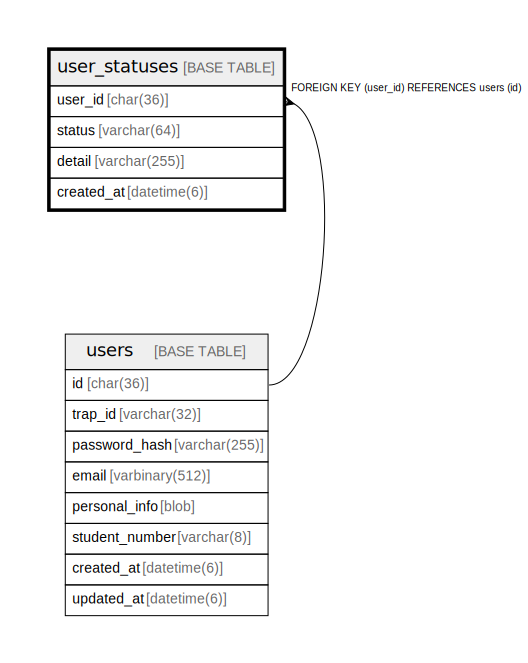

# user_statuses

## Description

ユーザーステータステーブル。  
会員期限管理により凍結処理を自動化。支払うと年度末までのアカウント使用権が与えられる。  


<details>
<summary><strong>Table Definition</strong></summary>

```sql
CREATE TABLE `user_statuses` (
  `user_id` char(36) NOT NULL,
  `status` varchar(64) NOT NULL COMMENT 'Status type: active, suspended, email-unconfirmed, etc.',
  `detail` varchar(255) DEFAULT NULL COMMENT 'Additional detail/reason',
  `created_at` datetime(6) NOT NULL DEFAULT current_timestamp(6),
  PRIMARY KEY (`user_id`,`status`),
  CONSTRAINT `fk_user_statuses_user` FOREIGN KEY (`user_id`) REFERENCES `users` (`id`) ON DELETE CASCADE ON UPDATE CASCADE
) ENGINE=InnoDB DEFAULT CHARSET=utf8mb4 COLLATE=utf8mb4_general_ci
```

</details>

## Labels

`ユーザー管理`

## Columns

| Name | Type | Default | Nullable | Children | Parents | Comment |
| ---- | ---- | ------- | -------- | -------- | ------- | ------- |
| user_id | char(36) |  | false |  | [users](users.md) | ユーザーUUID |
| status | varchar(64) |  | false |  |  | ステータス:<br />- active: アクティブ<br />- suspended: 凍結 (未支払い/卒業/除名)<br />- email-unconfirmed: メール未認証<br /> |
| detail | varchar(255) | NULL | true |  |  | 詳細/理由 |
| created_at | datetime(6) | current_timestamp(6) | false |  |  | 作成日時 |

## Constraints

| Name | Type | Definition | Comment |
| ---- | ---- | ---------- | ------- |
| fk_user_statuses_user | FOREIGN KEY | FOREIGN KEY (user_id) REFERENCES users (id) | ユーザー外部キー |
| PRIMARY | PRIMARY KEY | PRIMARY KEY (user_id, status) | 主キー |

## Indexes

| Name | Definition | Comment |
| ---- | ---------- | ------- |
| PRIMARY | PRIMARY KEY (user_id, status) USING BTREE | 主キー |

## Relations



---

> Generated by [tbls](https://github.com/k1LoW/tbls)
