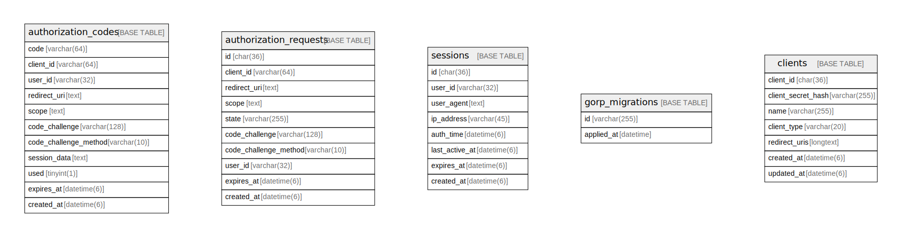

# oidc

## Tables

| Name | Columns | Comment | Type |
| ---- | ------- | ------- | ---- |
| [authorization_codes](authorization_codes.md) | 11 |  | BASE TABLE |
| [authorization_requests](authorization_requests.md) | 10 |  | BASE TABLE |
| [sessions](sessions.md) | 8 |  | BASE TABLE |
| [gorp_migrations](gorp_migrations.md) | 2 |  | BASE TABLE |
| [clients](clients.md) | 7 |  | BASE TABLE |

## Relations

---

> Generated by [tbls](https://github.com/k1LoW/tbls)
