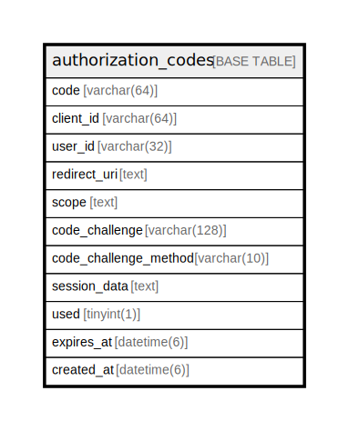

# authorization_codes

## Description

<details>
<summary><strong>Table Definition</strong></summary>

```sql
CREATE TABLE `authorization_codes` (
  `code` varchar(64) NOT NULL,
  `client_id` varchar(64) NOT NULL,
  `user_id` varchar(32) NOT NULL,
  `redirect_uri` text NOT NULL,
  `scope` text NOT NULL,
  `code_challenge` varchar(128) NOT NULL,
  `code_challenge_method` varchar(10) NOT NULL,
  `session_data` text NOT NULL,
  `used` tinyint(1) NOT NULL DEFAULT 0,
  `expires_at` datetime(6) NOT NULL,
  `created_at` datetime(6) NOT NULL DEFAULT current_timestamp(6),
  PRIMARY KEY (`code`)
) ENGINE=InnoDB DEFAULT CHARSET=utf8mb4 COLLATE=utf8mb4_general_ci
```

</details>

## Columns

| Name | Type | Default | Nullable | Children | Parents | Comment |
| ---- | ---- | ------- | -------- | -------- | ------- | ------- |
| code | varchar(64) |  | false |  |  |  |
| client_id | varchar(64) |  | false |  |  |  |
| user_id | varchar(32) |  | false |  |  |  |
| redirect_uri | text |  | false |  |  |  |
| scope | text |  | false |  |  |  |
| code_challenge | varchar(128) |  | false |  |  |  |
| code_challenge_method | varchar(10) |  | false |  |  |  |
| session_data | text |  | false |  |  |  |
| used | tinyint(1) | 0 | false |  |  |  |
| expires_at | datetime(6) |  | false |  |  |  |
| created_at | datetime(6) | current_timestamp(6) | false |  |  |  |

## Constraints

| Name | Type | Definition |
| ---- | ---- | ---------- |
| PRIMARY | PRIMARY KEY | PRIMARY KEY (code) |

## Indexes

| Name | Definition |
| ---- | ---------- |
| PRIMARY | PRIMARY KEY (code) USING BTREE |

## Relations



---

> Generated by [tbls](https://github.com/k1LoW/tbls)
