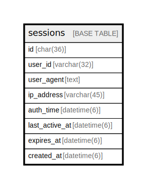

# sessions

## Description

<details>
<summary><strong>Table Definition</strong></summary>

```sql
CREATE TABLE `sessions` (
  `id` char(36) NOT NULL,
  `user_id` varchar(32) NOT NULL,
  `user_agent` text DEFAULT NULL,
  `ip_address` varchar(45) DEFAULT NULL,
  `auth_time` datetime(6) NOT NULL,
  `last_active_at` datetime(6) NOT NULL,
  `expires_at` datetime(6) NOT NULL,
  `created_at` datetime(6) NOT NULL DEFAULT current_timestamp(6),
  PRIMARY KEY (`id`),
  KEY `sessions_user_id_index` (`user_id`)
) ENGINE=InnoDB DEFAULT CHARSET=utf8mb4 COLLATE=utf8mb4_general_ci
```

</details>

## Columns

| Name | Type | Default | Nullable | Children | Parents | Comment |
| ---- | ---- | ------- | -------- | -------- | ------- | ------- |
| id | char(36) |  | false |  |  |  |
| user_id | varchar(32) |  | false |  |  |  |
| user_agent | text | NULL | true |  |  |  |
| ip_address | varchar(45) | NULL | true |  |  |  |
| auth_time | datetime(6) |  | false |  |  |  |
| last_active_at | datetime(6) |  | false |  |  |  |
| expires_at | datetime(6) |  | false |  |  |  |
| created_at | datetime(6) | current_timestamp(6) | false |  |  |  |

## Constraints

| Name | Type | Definition |
| ---- | ---- | ---------- |
| PRIMARY | PRIMARY KEY | PRIMARY KEY (id) |

## Indexes

| Name | Definition |
| ---- | ---------- |
| sessions_user_id_index | KEY sessions_user_id_index (user_id) USING BTREE |
| PRIMARY | PRIMARY KEY (id) USING BTREE |

## Relations



---

> Generated by [tbls](https://github.com/k1LoW/tbls)
