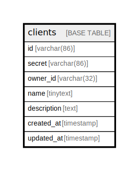

# clients

## Description

<details>
<summary><strong>Table Definition</strong></summary>

```sql
CREATE TABLE `clients` (
  `id` varchar(86) NOT NULL,
  `secret` varchar(86) DEFAULT NULL,
  `owner_id` varchar(32) DEFAULT NULL,
  `name` tinytext DEFAULT NULL,
  `description` text DEFAULT NULL,
  `created_at` timestamp NULL DEFAULT NULL,
  `updated_at` timestamp NULL DEFAULT NULL,
  PRIMARY KEY (`id`)
) ENGINE=InnoDB DEFAULT CHARSET=utf8mb4 COLLATE=utf8mb4_general_ci
```

</details>

## Columns

| Name | Type | Default | Nullable | Children | Parents | Comment |
| ---- | ---- | ------- | -------- | -------- | ------- | ------- |
| id | varchar(86) |  | false |  |  |  |
| secret | varchar(86) | NULL | true |  |  |  |
| owner_id | varchar(32) | NULL | true |  |  |  |
| name | tinytext | NULL | true |  |  |  |
| description | text | NULL | true |  |  |  |
| created_at | timestamp | NULL | true |  |  |  |
| updated_at | timestamp | NULL | true |  |  |  |

## Constraints

| Name | Type | Definition |
| ---- | ---- | ---------- |
| PRIMARY | PRIMARY KEY | PRIMARY KEY (id) |

## Indexes

| Name | Definition |
| ---- | ---------- |
| PRIMARY | PRIMARY KEY (id) USING BTREE |

## Relations



---

> Generated by [tbls](https://github.com/k1LoW/tbls)
