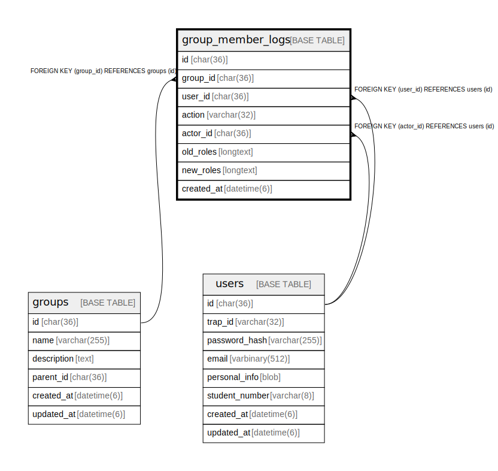

# group_member_logs

## Description

<details>
<summary><strong>Table Definition</strong></summary>

```sql
CREATE TABLE `group_member_logs` (
  `id` char(36) NOT NULL COMMENT 'UUID v4',
  `group_id` char(36) NOT NULL,
  `user_id` char(36) NOT NULL,
  `action` varchar(32) NOT NULL COMMENT 'Action: added, removed, role_changed',
  `actor_id` char(36) DEFAULT NULL COMMENT 'User who performed the action',
  `old_roles` longtext CHARACTER SET utf8mb4 COLLATE utf8mb4_bin DEFAULT NULL CHECK (json_valid(`old_roles`)),
  `new_roles` longtext CHARACTER SET utf8mb4 COLLATE utf8mb4_bin DEFAULT NULL CHECK (json_valid(`new_roles`)),
  `created_at` datetime(6) NOT NULL DEFAULT current_timestamp(6),
  PRIMARY KEY (`id`),
  KEY `idx_group_member_logs_group` (`group_id`),
  KEY `idx_group_member_logs_user` (`user_id`),
  KEY `idx_group_member_logs_actor` (`actor_id`),
  KEY `idx_group_member_logs_created_at` (`created_at`),
  CONSTRAINT `fk_group_member_logs_actor` FOREIGN KEY (`actor_id`) REFERENCES `users` (`id`) ON DELETE SET NULL,
  CONSTRAINT `fk_group_member_logs_group` FOREIGN KEY (`group_id`) REFERENCES `groups` (`id`) ON DELETE CASCADE,
  CONSTRAINT `fk_group_member_logs_user` FOREIGN KEY (`user_id`) REFERENCES `users` (`id`) ON DELETE CASCADE
) ENGINE=InnoDB DEFAULT CHARSET=utf8mb4 COLLATE=utf8mb4_general_ci
```

</details>

## Columns

| Name | Type | Default | Nullable | Children | Parents | Comment |
| ---- | ---- | ------- | -------- | -------- | ------- | ------- |
| id | char(36) |  | false |  |  | UUID v4 |
| group_id | char(36) |  | false |  | [groups](groups.md) |  |
| user_id | char(36) |  | false |  | [users](users.md) |  |
| action | varchar(32) |  | false |  |  | Action: added, removed, role_changed |
| actor_id | char(36) | NULL | true |  | [users](users.md) | User who performed the action |
| old_roles | longtext | NULL | true |  |  |  |
| new_roles | longtext | NULL | true |  |  |  |
| created_at | datetime(6) | current_timestamp(6) | false |  |  |  |

## Constraints

| Name | Type | Definition |
| ---- | ---- | ---------- |
| fk_group_member_logs_actor | FOREIGN KEY | FOREIGN KEY (actor_id) REFERENCES users (id) |
| fk_group_member_logs_group | FOREIGN KEY | FOREIGN KEY (group_id) REFERENCES groups (id) |
| fk_group_member_logs_user | FOREIGN KEY | FOREIGN KEY (user_id) REFERENCES users (id) |
| PRIMARY | PRIMARY KEY | PRIMARY KEY (id) |
| old_roles | CHECK | CHECK (json_valid(`old_roles`)) |
| new_roles | CHECK | CHECK (json_valid(`new_roles`)) |

## Indexes

| Name | Definition |
| ---- | ---------- |
| idx_group_member_logs_actor | KEY idx_group_member_logs_actor (actor_id) USING BTREE |
| idx_group_member_logs_created_at | KEY idx_group_member_logs_created_at (created_at) USING BTREE |
| idx_group_member_logs_group | KEY idx_group_member_logs_group (group_id) USING BTREE |
| idx_group_member_logs_user | KEY idx_group_member_logs_user (user_id) USING BTREE |
| PRIMARY | PRIMARY KEY (id) USING BTREE |

## Relations



---

> Generated by [tbls](https://github.com/k1LoW/tbls)
