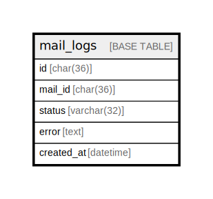

# mail_logs

## Description

<details>
<summary><strong>Table Definition</strong></summary>

```sql
CREATE TABLE `mail_logs` (
  `id` char(36) NOT NULL,
  `mail_id` char(36) DEFAULT NULL,
  `status` varchar(32) DEFAULT NULL,
  `error` text DEFAULT NULL,
  `created_at` datetime DEFAULT NULL,
  PRIMARY KEY (`id`)
) ENGINE=InnoDB DEFAULT CHARSET=utf8mb4 COLLATE=utf8mb4_general_ci
```

</details>

## Columns

| Name | Type | Default | Nullable | Children | Parents | Comment |
| ---- | ---- | ------- | -------- | -------- | ------- | ------- |
| id | char(36) |  | false |  |  |  |
| mail_id | char(36) | NULL | true |  |  |  |
| status | varchar(32) | NULL | true |  |  |  |
| error | text | NULL | true |  |  |  |
| created_at | datetime | NULL | true |  |  |  |

## Constraints

| Name | Type | Definition |
| ---- | ---- | ---------- |
| PRIMARY | PRIMARY KEY | PRIMARY KEY (id) |

## Indexes

| Name | Definition |
| ---- | ---------- |
| PRIMARY | PRIMARY KEY (id) USING BTREE |

## Relations



---

> Generated by [tbls](https://github.com/k1LoW/tbls)
