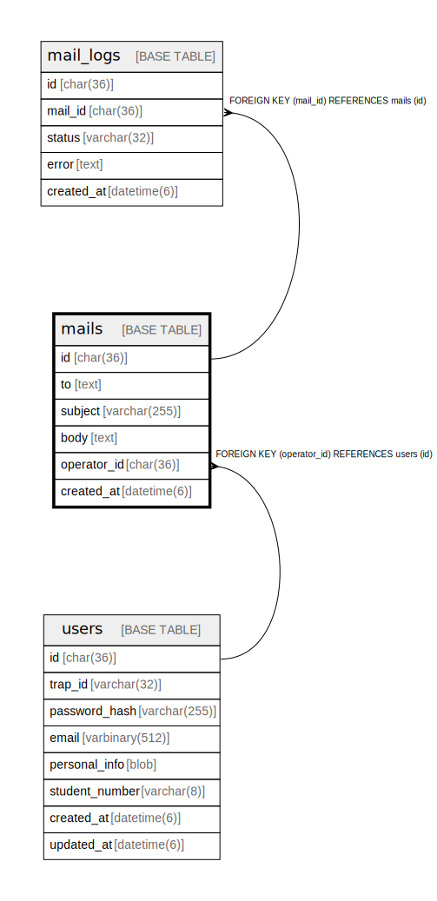

# mails

## Description

<details>
<summary><strong>Table Definition</strong></summary>

```sql
CREATE TABLE `mails` (
  `id` char(36) NOT NULL,
  `to` text DEFAULT NULL,
  `sub` varchar(255) DEFAULT NULL,
  `main` text DEFAULT NULL,
  `operator_id` varchar(32) DEFAULT NULL,
  `created_at` datetime DEFAULT NULL,
  PRIMARY KEY (`id`)
) ENGINE=InnoDB DEFAULT CHARSET=utf8mb4 COLLATE=utf8mb4_general_ci
```

</details>

## Columns

| Name | Type | Default | Nullable | Children | Parents | Comment |
| ---- | ---- | ------- | -------- | -------- | ------- | ------- |
| id | char(36) |  | false |  |  |  |
| to | text | NULL | true |  |  |  |
| sub | varchar(255) | NULL | true |  |  |  |
| main | text | NULL | true |  |  |  |
| operator_id | varchar(32) | NULL | true |  |  |  |
| created_at | datetime | NULL | true |  |  |  |

## Constraints

| Name | Type | Definition |
| ---- | ---- | ---------- |
| PRIMARY | PRIMARY KEY | PRIMARY KEY (id) |

## Indexes

| Name | Definition |
| ---- | ---------- |
| PRIMARY | PRIMARY KEY (id) USING BTREE |

## Relations



---

> Generated by [tbls](https://github.com/k1LoW/tbls)
