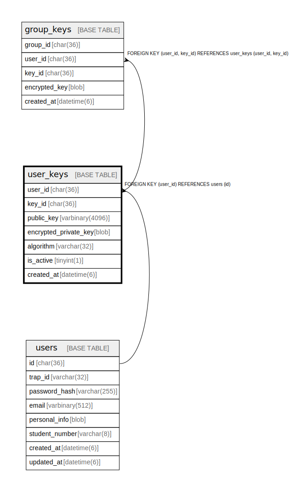

# user_keys

## Description

<details>
<summary><strong>Table Definition</strong></summary>

```sql
CREATE TABLE `user_keys` (
  `user_id` char(36) NOT NULL,
  `key_id` char(36) NOT NULL COMMENT 'UUID v4',
  `public_key` varbinary(4096) NOT NULL COMMENT 'User public key (DER format)',
  `encrypted_private_key` blob NOT NULL COMMENT 'Private key encrypted with user password-derived key',
  `algorithm` varchar(32) NOT NULL DEFAULT 'RSA-OAEP-SHA256' COMMENT 'Key algorithm',
  `is_active` tinyint(1) NOT NULL DEFAULT 1,
  `created_at` datetime(6) NOT NULL DEFAULT current_timestamp(6),
  PRIMARY KEY (`user_id`,`key_id`),
  KEY `idx_user_keys_active` (`user_id`,`is_active`),
  CONSTRAINT `fk_user_keys_user` FOREIGN KEY (`user_id`) REFERENCES `users` (`id`) ON DELETE CASCADE
) ENGINE=InnoDB DEFAULT CHARSET=utf8mb4 COLLATE=utf8mb4_general_ci
```

</details>

## Columns

| Name | Type | Default | Nullable | Children | Parents | Comment |
| ---- | ---- | ------- | -------- | -------- | ------- | ------- |
| user_id | char(36) |  | false | [group_keys](group_keys.md) | [users](users.md) |  |
| key_id | char(36) |  | false | [group_keys](group_keys.md) |  | UUID v4 |
| public_key | varbinary(4096) |  | false |  |  | User public key (DER format) |
| encrypted_private_key | blob |  | false |  |  | Private key encrypted with user password-derived key |
| algorithm | varchar(32) | 'RSA-OAEP-SHA256' | false |  |  | Key algorithm |
| is_active | tinyint(1) | 1 | false |  |  |  |
| created_at | datetime(6) | current_timestamp(6) | false |  |  |  |

## Constraints

| Name | Type | Definition |
| ---- | ---- | ---------- |
| fk_user_keys_user | FOREIGN KEY | FOREIGN KEY (user_id) REFERENCES users (id) |
| PRIMARY | PRIMARY KEY | PRIMARY KEY (user_id, key_id) |

## Indexes

| Name | Definition |
| ---- | ---------- |
| idx_user_keys_active | KEY idx_user_keys_active (user_id, is_active) USING BTREE |
| PRIMARY | PRIMARY KEY (user_id, key_id) USING BTREE |

## Relations



---

> Generated by [tbls](https://github.com/k1LoW/tbls)
