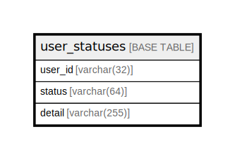

# user_statuses

## Description

<details>
<summary><strong>Table Definition</strong></summary>

```sql
CREATE TABLE `user_statuses` (
  `user_id` varchar(32) NOT NULL,
  `status` varchar(64) NOT NULL,
  `detail` varchar(255) DEFAULT NULL,
  PRIMARY KEY (`user_id`,`status`)
) ENGINE=InnoDB DEFAULT CHARSET=utf8mb4 COLLATE=utf8mb4_general_ci
```

</details>

## Columns

| Name | Type | Default | Nullable | Children | Parents | Comment |
| ---- | ---- | ------- | -------- | -------- | ------- | ------- |
| user_id | varchar(32) |  | false |  |  |  |
| status | varchar(64) |  | false |  |  |  |
| detail | varchar(255) | NULL | true |  |  |  |

## Constraints

| Name | Type | Definition |
| ---- | ---- | ---------- |
| PRIMARY | PRIMARY KEY | PRIMARY KEY (user_id, status) |

## Indexes

| Name | Definition |
| ---- | ---------- |
| PRIMARY | PRIMARY KEY (user_id, status) USING BTREE |

## Relations



---

> Generated by [tbls](https://github.com/k1LoW/tbls)
