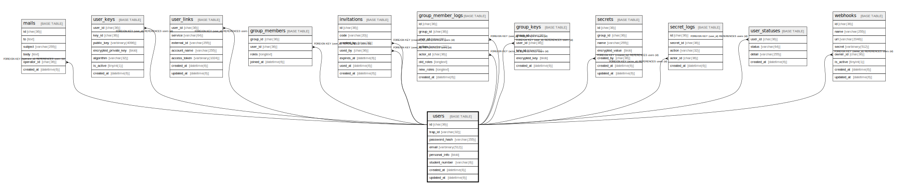

# users

## Description

<details>
<summary><strong>Table Definition</strong></summary>

```sql
CREATE TABLE `users` (
  `id` char(36) NOT NULL COMMENT 'UUID v4',
  `trap_id` varchar(32) NOT NULL COMMENT 'traP ID (unique username)',
  `password_hash` varchar(255) NOT NULL COMMENT 'PBKDF2-SHA512 hash',
  `email` varbinary(512) DEFAULT NULL COMMENT 'AES-GCM encrypted email',
  `personal_info` blob DEFAULT NULL COMMENT 'AES-GCM encrypted JSON (name, phone, address, etc.)',
  `student_number` varchar(8) DEFAULT NULL COMMENT 'Student number (plaintext for lookup)',
  `created_at` datetime(6) NOT NULL DEFAULT current_timestamp(6),
  `updated_at` datetime(6) NOT NULL DEFAULT current_timestamp(6) ON UPDATE current_timestamp(6),
  PRIMARY KEY (`id`),
  UNIQUE KEY `uq_users_trap_id` (`trap_id`),
  UNIQUE KEY `uq_users_student_number` (`student_number`),
  KEY `idx_users_created_at` (`created_at`)
) ENGINE=InnoDB DEFAULT CHARSET=utf8mb4 COLLATE=utf8mb4_general_ci
```

</details>

## Columns

| Name | Type | Default | Nullable | Extra Definition | Children | Parents | Comment |
| ---- | ---- | ------- | -------- | ---------------- | -------- | ------- | ------- |
| id | char(36) |  | false |  | [mails](mails.md) [user_keys](user_keys.md) [user_links](user_links.md) [group_members](group_members.md) [invitations](invitations.md) [group_member_logs](group_member_logs.md) [group_keys](group_keys.md) [secrets](secrets.md) [secret_logs](secret_logs.md) [user_statuses](user_statuses.md) [webhooks](webhooks.md) |  | UUID v4 |
| trap_id | varchar(32) |  | false |  |  |  | traP ID (unique username) |
| password_hash | varchar(255) |  | false |  |  |  | PBKDF2-SHA512 hash |
| email | varbinary(512) | NULL | true |  |  |  | AES-GCM encrypted email |
| personal_info | blob | NULL | true |  |  |  | AES-GCM encrypted JSON (name, phone, address, etc.) |
| student_number | varchar(8) | NULL | true |  |  |  | Student number (plaintext for lookup) |
| created_at | datetime(6) | current_timestamp(6) | false |  |  |  |  |
| updated_at | datetime(6) | current_timestamp(6) | false | on update current_timestamp(6) |  |  |  |

## Constraints

| Name | Type | Definition |
| ---- | ---- | ---------- |
| PRIMARY | PRIMARY KEY | PRIMARY KEY (id) |
| uq_users_student_number | UNIQUE | UNIQUE KEY uq_users_student_number (student_number) |
| uq_users_trap_id | UNIQUE | UNIQUE KEY uq_users_trap_id (trap_id) |

## Indexes

| Name | Definition |
| ---- | ---------- |
| idx_users_created_at | KEY idx_users_created_at (created_at) USING BTREE |
| PRIMARY | PRIMARY KEY (id) USING BTREE |
| uq_users_student_number | UNIQUE KEY uq_users_student_number (student_number) USING BTREE |
| uq_users_trap_id | UNIQUE KEY uq_users_trap_id (trap_id) USING BTREE |

## Relations



---

> Generated by [tbls](https://github.com/k1LoW/tbls)
