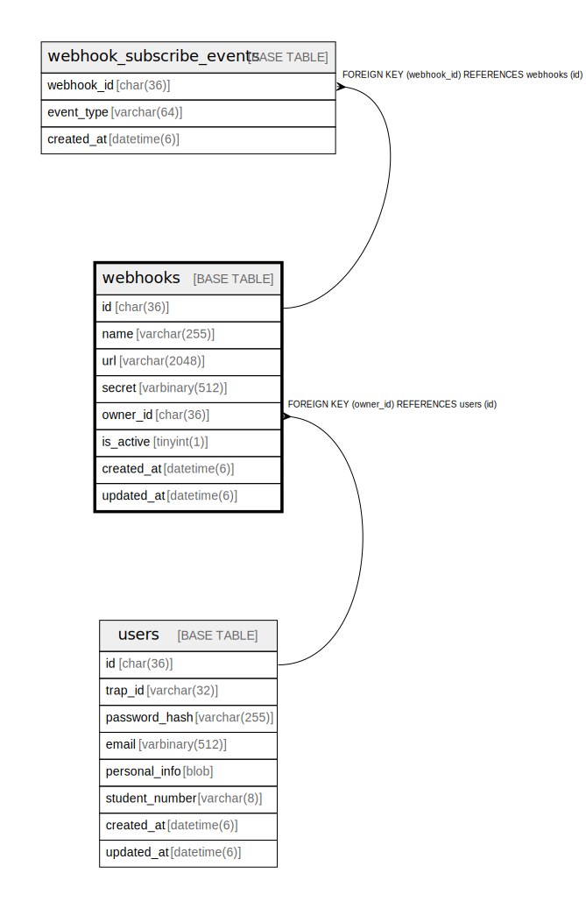

# webhooks

## Description

<details>
<summary><strong>Table Definition</strong></summary>

```sql
CREATE TABLE `webhooks` (
  `id` char(36) NOT NULL COMMENT 'UUID v4',
  `name` varchar(255) NOT NULL,
  `url` varchar(2048) NOT NULL,
  `secret` varbinary(512) DEFAULT NULL COMMENT 'HMAC signing secret (encrypted)',
  `owner_id` char(36) DEFAULT NULL COMMENT 'User who owns this webhook',
  `is_active` tinyint(1) NOT NULL DEFAULT 1,
  `created_at` datetime(6) NOT NULL DEFAULT current_timestamp(6),
  `updated_at` datetime(6) NOT NULL DEFAULT current_timestamp(6) ON UPDATE current_timestamp(6),
  PRIMARY KEY (`id`),
  KEY `idx_webhooks_owner` (`owner_id`),
  KEY `idx_webhooks_active` (`is_active`),
  CONSTRAINT `fk_webhooks_owner` FOREIGN KEY (`owner_id`) REFERENCES `users` (`id`) ON DELETE SET NULL
) ENGINE=InnoDB DEFAULT CHARSET=utf8mb4 COLLATE=utf8mb4_general_ci
```

</details>

## Columns

| Name | Type | Default | Nullable | Extra Definition | Children | Parents | Comment |
| ---- | ---- | ------- | -------- | ---------------- | -------- | ------- | ------- |
| id | char(36) |  | false |  | [webhook_subscribe_events](webhook_subscribe_events.md) |  | UUID v4 |
| name | varchar(255) |  | false |  |  |  |  |
| url | varchar(2048) |  | false |  |  |  |  |
| secret | varbinary(512) | NULL | true |  |  |  | HMAC signing secret (encrypted) |
| owner_id | char(36) | NULL | true |  |  | [users](users.md) | User who owns this webhook |
| is_active | tinyint(1) | 1 | false |  |  |  |  |
| created_at | datetime(6) | current_timestamp(6) | false |  |  |  |  |
| updated_at | datetime(6) | current_timestamp(6) | false | on update current_timestamp(6) |  |  |  |

## Constraints

| Name | Type | Definition |
| ---- | ---- | ---------- |
| fk_webhooks_owner | FOREIGN KEY | FOREIGN KEY (owner_id) REFERENCES users (id) |
| PRIMARY | PRIMARY KEY | PRIMARY KEY (id) |

## Indexes

| Name | Definition |
| ---- | ---------- |
| idx_webhooks_active | KEY idx_webhooks_active (is_active) USING BTREE |
| idx_webhooks_owner | KEY idx_webhooks_owner (owner_id) USING BTREE |
| PRIMARY | PRIMARY KEY (id) USING BTREE |

## Relations



---

> Generated by [tbls](https://github.com/k1LoW/tbls)
