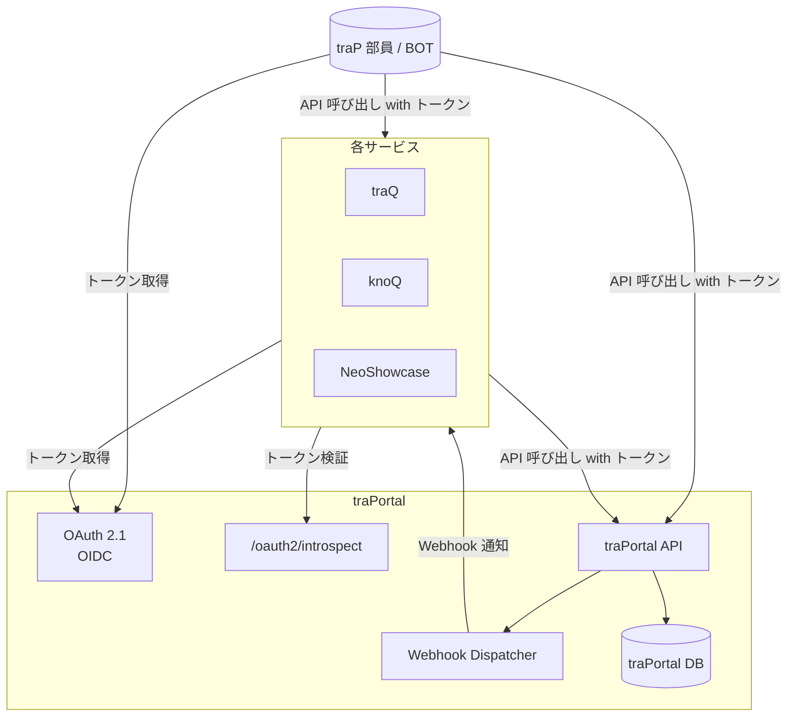
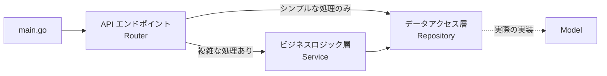

# traPortal v2 全仕様

本ドキュメントを traPortal v2 の最新仕様とする！

## 本ドキュメントの目的

仕様を決める際の判断理由を明確にし、開発メンバー全員が個々の実装判断を的確に行えるようにする。技術的な詳細は開発時に決定するため、仕様段階では厳密な定義を求めない。以下の順に決めて手戻りを防ごう！

1. ユーザーストーリー
   各ユーザーの立場に立ち、顧客が本当に求めているものを明らかにする。
2. 機能
   ユーザーの要求を根拠として、各機能の詳細を詰める。これによりユーザーが本当に必要とするものだけを実装対象にできる。
3. 技術設計
   機能が確定したら API と DB テーブルを設計する。

## TL;DR
### これまでのびみょいとこ

- 情報が一元管理されてない
    - ユーザー管理が traQ・traPortal に分散し、複数システムで作業が必要
    - グループ管理が traQ・knoQ・traPortal で独自のグループ機能を実装しており、同期していない
    - 認証認可基盤が traQ にある
    - グループ内権限管理がさまざまなサードパーティ製サービスに分散している
- いろんなサービスに問い合わせてて構造が複雑
- 新入生や役員の負担軽減
    - 誰がどの権限を持っているかわからない
    - traQ に平文で共有していたシークレットをグループで安全に管理する
    - アカウントの個人情報入力の 2 段階設定を 1 回で済ませる(システム根幹にはかかわらないから保留)
    - パスワードのみ → Passkey 対応
- v1に対して開発効率の向上 (アーキテクチャでの保守性の向上、テストやツールなどの整備)

### 生まれ変わった traPortal v2 の機能

個人情報やお金を扱う機能を 1 つのサービスが請け負って高セキュリティを維持することで安全に扱えるようにする。

| 機能             | 概要                                           |
| ---------------- | ---------------------------------------------- |
| ユーザー管理     | 個人情報は暗号化する                           |
| グループ機能     | ロールで管理できてシークレットを持てるグループ |
| 連携機能         | SSO をしたり Webhook による通知する            |
| シークレット管理 | グループごとの暗号化パスワード管理             |

## ユーザーストーリー

### 新入生

- 迷うことなくアカウントを作成したい
- 部費の入金が一瞬でできて、サービスを 1 秒でも早く最速で使いたい！
- traP ってサービスがたくさんあって複雑なので、できるだけ新入生にわかりやすい形にして馴染める導線を作りたい

### 一般ユーザー

- SSO 基盤を使って楽にログインしたい
- 「権限をもってる人に連絡したい → グループ検索 → グループでメンション」と楽に連絡できる

### グループ管理者 / プロジェクトリーダー

- チャットでの平文共有を避けてプロジェクトで使用する共用アカウント (Twitter, GitHub 等) のパスワードや API キーを現在のグループメンバーだけが閲覧できるように共有したい
- グループがどのサービスでも同様に機能 (メンション・カレンダーなど) を使いたい
- OAuth で各サービスに与える権限を割り振りたい
- グループ管理を楽にしてリーダーが交代したり卒業したりしても属人化を防止したい
- ユーザーそれぞれに権限を設定するのはめんどい
- 最小権限の原則を満たしたい

### 庶務 / SysAd 管理者

- 凍結処理がめんどいのでなくしたい
- 卒業した人や問題のあるユーザーを凍結/解除したい
- アカウント登録の招待コードを発行したい
- 名簿作成や状況確認を効率的に行いたい
    - ユーザー一覧を CSV 等でエクスポートできる
    - ユーザーの状態（アクティブ/凍結等）を検索でき、一覧で確認できる

### 外部サービス開発者

- SSO 基盤を用いて安全にサービスを公開したい
- OAuth でユーザーの所属グループを取得して適切な権限スコープで情報を制限したい

## traPortal v2 の機能詳細

### ユーザー管理

traP 部員のアカウントと個人情報を受け持つ。

#### アカウント作成時

1. traPortal で traP の規約を読んでアカウント登録する
2. メール認証
3. Stripe に移動して振り込み
4. traQ に SSO ログイン

#### アカウント凍結時

凍結処理はなくして、支払うと年度末までのアカウント使用権が与えられるようにする(会員期限延長)。会員期限をいつにするかは役員会に決めてもらう。

1. traPortal にリダイレクトしてログイン不可
2. 未支払いなら Stripe に移動して振り込み、卒業生や除名なら不可
3. traPortal にログイン

#### ex-traP 移行時

1. traP の traPortal で署名付き登録 URL を発行する
2. アカウントを登録
3. メール認証

判断したポイント
- 極限までシンプルにする
    - メール認証により科学大の正規生であることを証明できる
        - 非正規生 (研究生、聴講生、特別聴講学生、短期交換留学生など) や教職員は不可
        - 卒業生は数カ月程度の猶予期間を経て削除されるので凍結には使えない
        - 外部の方を招待コードを発行して入れるユースケースってあるだろうか？
            - 外から活動があまり見れないという問題がある
    - ブランディングするために幽霊部員は排除すべきだが入部難易度を上げるというやり方にすべきではない
- 収支予測して部費変更ができるように Stripe の自動引き落としはせず毎年徴収する
    - もし部費変更できるように自動引き落としできるなら実装する
- アカウント登録で traPortal にアタックサーフェスが集中するけれども高セキュリティで設計すればいい

#### 個人情報の暗号化

個人情報に関する法律・規則に準拠すべきである。

1. 日本の個人情報保護法
    - [個人情報保護法 第26条](https://laws.e-gov.go.jp/law/415AC0000000057#Mp-Ch_4-Se_2-At_26)
    - [個人情報保護法施行規則 第7条](https://laws.e-gov.go.jp/law/428M60020000003#Mp-At_7)
    - ここにおける事業とは一定の目的をもって反復継続して遂行される同種の行為であって、かつ社会通念上事業と認められるもの
    - traP とは創作は基本 1 人でもできるけど traP に入るとグループでの創作活動や知見共有など複数人集まったときの恩恵が得られる組織
    - 高度な暗号化 (AES-256 以上) がされていない個人情報が 1000 人以上漏洩した場合に個人情報保護委員会に報告しなければならない
2. 東京科学大学の学則
    - [国立大学法人東京科学大学個人情報管理細則](https://www.somuka.titech.ac.jp/reiki_int/reiki_honbun/x385RG00002085.html)
    - サークルは自主運営団体であり、大学規則に従う必要はない
    - 課外活動団体に関する規則も見たが別に規定しているものはなかった
3. traP サークル規約・個人情報保護規則
    - [traPortal 規則](https://portal.trap.jp/trap/terms)
    - 過去の役員会の議論を踏まえると「構成員同士の円滑な連絡のため」がある理由は薄い。よって庶務のみが個人情報を閲覧する形であるべき。漏洩した場合、個人を特定できるようにして抑止力にする。

これらを元に仕様は次のようになる。

- 個人情報は暗号化して漏洩しても閲覧できないようにする
- 個人情報を平文で DM に貼り付けるのは禁止してパスワード付き ZIP とかにするガイドラインを設ける

これに対して公開する意見がある。
- traQという匿名のSNSではなく traPという大学の公認サークルなので, 誰かがやらかしたら全体として責任を取る必要がある. サークルメンバーは赤の他人ではないので構成員の本名ぐらいは知っておくべき. 
    - 庶務が対応すればいい
- 性差を意識したコミュニケーションをしたい
    - これが多数派の意見なら議論する価値ある
    - 情報開示のリスクが高い少数派である女性メンバーの意見も聞いて決めると良さそう

私たちは個人情報を保護する方向で進めたい。この理由に強く反対する人がいれば役員会で議論する。とりあえず仕様を決めた上で役員会で暗号化の方法を説明して議論してもらおう。

### グループ機能

グループとは行動を共にする集団を表現する。traQ にあるグループだと思えば良くて、これまで traQ や knoQ や traPortal で独自でグループと同等の機能が存在し、traPortal v2 では 1 つに統一する。

グループは基本的に次の要素で構成される。

:::info
今ここが割とあやふやなので一緒に考えたい。
- グループメンバーを追加するときにグループでいれられるようにする必要性
:::

| 用語         | 説明                                                                                                                   |
| ------------ | ---------------------------------------------------------------------------------------------------------------------- |
| メンバー     | グループに所属するユーザーでメンションなどの対象となる                                                                 |
| 外部管理者   | メンバーではないがグループを管理できるユーザー                                                                         |
| ロール       | メンバーや外部管理者に付与できるグループ内権限                                                                         |
| 権限         | グループに発行する識別子。認証認可時に claim できて traPortal を含む外部サービスはアクセス制御を行う。誰でも閲覧可能。 |
| シークレット | パスワードや API キーなどを書き込み、メンバーなら誰でも読めて、traPortal admin は読めない                              |

グループには通常グループと公開グループがあってそれぞれこんな感じ。

|                    | 通常グループ                       | 公開グループ |
| ------------------ | ---------------------------------- | ------------ |
| 管理者             | あり                               | なし         |
| グループ作成       | 誰でも自由                         | 誰でも自由   |
| 参加方法           | メンバー変更ロールが追加           | 自由参加     |
| 退会方法           | メンバー変更ロールまたは自分が削除 | 自由退会     |
| シークレット暗号化 | E2E 暗号化                         | 平文         |

グループ内に付与されるロールは次のロールで限定される。開発時に各ユーザーに適当なデフォルトロールを割り当てる。デフォルトロールはロール付与で編集可能。

| ロール           | 説明                                          |
| ---------------- | --------------------------------------------- |
| ロール付与       | メンバーにロールを付与できる (実質管理者権限) |
| メンバー変更     | グループメンバーを追加したり削除できる        |
| グループ編集     | グループ名・説明欄を変更できる                |
| グループ削除     | グループを削除できる                          |
| シークレット編集 | グループのシークレットを書き換えられる        |

権限は個人に権限付与する形だと大変なのでグループに付与する。
traPortal が使う権限は例えばこんな感じ。

| グループ       | 権限                       |
| -------------- | -------------------------- |
| 庶務           | ユーザー個人情報閲覧/編集  |
| 庶務 渉外      | メール送受信               |
|                | ユーザー凍結/解除          |
| 庶務           | Password Recovery          |
| サービス管理者 | admin のアクセス・実行権限 |

#### 検討事項

満たしたい条件はこんな感じ。

- 1 サービス = 1 グループ
    - グループの定義と迎合してる
    - 横断権限の場合がめんどい
- 1 権限 = 1 グループ
    - 権限をもってる人に連絡したい → グループ検索 → グループでメンション
    - ユーザーそれぞれに権限を設定しなくて良い
- グループ管理を楽にして卒業時の属人化を防止したい
    - 例えばプロジェクトグループ = フロントグループ + バックグループ + デザイングループみたいにして子グループのメンバーを編集すれば親グループも自動的に編集されるようにしたい
    - 外部管理者だったり、大量のグループを管理するグループを外部管理者に入れて柔軟に管理したい
- 権限をできる限り減らす (最小権限の原則)
- 良い UI/UX
- セキュリティリスクを減らしたいけど自分で開発したい
- 柔軟な条件式は今のところ必要ない
- 管理権限の階層はなくてよい (オーナー > 管理者 > モデレーター > ...)

これすべて満たすには RBAC + ReBAC + グループベースをいい感じに織り交ぜて権限管理するのが良さそう。セキュリティを無視すれば ReBAC 一本でいい。
親グループのロールはメンバーを展開して適用する？グループ削除時は子グループとは独立？

- 階層構造
    - グループに親子関係がある
    - 管理者グループなどグループベースと相性がいい
    - 管理者グループを複数グループで共有しやすい (使わなさそう)
    - 管理権限の階層 (オーナー > 管理者 > モデレーター > ...) (使わなさそう)
    - 階層構造の階層が増えていくと複雑化・権限集中
    - 逆に 3 階層までと限定すると 3 階層目の管理者グループの扱いがトリッキー
    - 単純に既存のグループにオーナーグループが追加されて倍になる
    - 同じような権限を持つグループが乱立する
    - 特権を割り当てる人が superuser で複雑
- グループベース
    - グループに権限が付与される
    - 最小権限の原則を満たすように 1 サービスに複数のグループが生成されて運用が大変
    - 権限を 1 回設定すれば全員が使えて運用が楽
        - ユーザーそれぞれに設定しなくてよくて楽
- RBAC
    - ロールによって権限を振る
    - 権限横断ができない
    - 各ユーザーに設定するのが大変
    - 1 サービス = 1 グループ
- ReBAC
    - ユーザーとグループに関する関係で権限を定義する
    - 最もシンプルで自由度が高い
    - 自由度が高い為、制約を用いてあってはならない状態を防ぐのだが、バグる可能性があり怖い
    - それを上回る拡張することによるユースケースが見つからなかった為棄却
        - 卒業時の運用が楽
        - 権限を消したときの影響分析
        - ソーシャルグラフ
    - 部分的に実装してもよい
- ABAC
    - 条件式によって権限を付与する
    - ポリシーが複雑化しやすい
    - 今のところユースケースが学年しかなく不要と判断

#### 過去の仕様

階層構造がありサブグループにオーナーグループというグループ管理者権限を持つグループがあった。

グループタイプがあった。

| type        | 作成権限   | 備考                           |
| ----------- | ---------- | ------------------------------ |
| traP 直下   | 役員会のみ | -                              |
| `grade`     | 役員会のみ | 学年グループ                   |
| `project`   | 役員会のみ | プロジェクトグループ           |
| `team`      | -          | チームグループ                 |
| `executive` | -          | 役員会グループ                 |
| `admin`     | -          | 管理者グループ                 |
| `normal`    | -          | 通常グループ（自由に作成可能） |

is_free_join フラグ
- 誰でも出入り自由
- admin による管理が必要

is_admin_group フラグ
- 親グループの admin グループ

is_essential
- Portal の運用上必要不可欠な permission（v1 での `privilege` 相当）
- `is_essential == true` の permission は削除不可、`name` や `is_essential` フィールドの変更不可

### シークレット管理

サーバー運用者が見れたり DB 漏洩したとき閲覧できるとよくない。Vaultwarden のセルフホストしてもいいがサインインの利便性が下がる。

- 個人情報やグループごとにシークレット (パスワードや API キーなど) を保存
- グループメンバーのみ閲覧可能、DB 漏洩しても共通鍵なしで復号不可

| 方式             | DB 漏洩 | サーバー運用者            | 難易度     | 対象                           |
| ---------------- | ------- | ------------------------- | ---------- | ------------------------------ |
| 平文             | 見れる  | 見れる                    | かんたん   | traP ID                        |
| サーバー側暗号化 | 守れる  | 見れる                    | ふつう     | メアド                         |
| E2E 暗号化       | 守れる  | 守れる (悪意あると見れる) | むずかしい | 個人情報・グループシークレット |

E2E 暗号化とはユーザーとユーザーの間でのみ暗号が復号できるもの。サーバー運用者の閲覧を防ぐことができる。グループごとのシークレット次のように管理する。
- ユーザーの秘密から KDF (鍵導出関数) で Master Key を生成し、鍵を暗号化して保存する
- ユーザーの秘密 → Master Key → Symmetric Key 復号 → Private Key 復号 → Org Key 復号 → データ復号
- グループ全員がパスワードを忘れたらシークレットが消える

個人情報については個人と庶務のグループのシークレットと考えれば良い。

パスワードマネージャーがよくやっていてこんな手法で行っている。

|                           | Bitwarden        | 1Password                         |
| ------------------------- | ---------------- | --------------------------------- |
| ユーザーの秘密            | Password + Email | Password + Secret Key             |
| ブラウザ変更時の手間      | なし             | Secret Key を共有しないといけない |
| パスワードリセット (個人) | 不可能           | Recovery Code                     |
| パスワードリセット (組織) | 再招待           | 管理者が許可                      |
| 認証                      | Password Hash    | SRP                               |

パスワードリセットにおいてメアドだけサーバー側暗号化にして自動再招待にすればよい。
- メール認証にメアドが必要
- メアドの乗っ取りは大学の責任になるのでメール認証が通れば本人と証明できる。

ガイドライン
- DB アクセス権を持つ人と Recovery Group を分けることでデータは見れない

個人情報を用いて集計することはしないので Intel SGX や準同型暗号は不要。


#### LLM による E2E 暗号化における鍵管理の要約

```
┌─────────────────────────── 個人の鍵階層 ────────────────────────────────────┐
│                                                                              │
│   ユーザーの秘密                            CSPRNG(256bit)                     │
│         │                                       │                            │
│         ▼ PBKDF2(10万回)                        ▼                            │
│   ┌───────────┐                           ┌─────────────┐    ┌────────────┐  │
│   │ Master Key│ ★サーバーに送らない        │Symmetric Key│───▶│Private Key │  │
│   └─────┬─────┘                           └──────┬──────┘    └─────┬──────┘  │
│         │                                        │ AES暗号化       │          │
│    ┌────┴────┐                                   ▼                │          │
│    │         │                           ┌────────────────┐       │          │
│    ▼         ▼                           │ Encrypted      │       │          │
│  HKDF    PBKDF2(1回)                     │ Private Key    │◀──────┘          │
│    │         │                           └────────────────┘                  │
│    ▼         ▼                                  ↓ DB保存                      │
│ Stretched  Password Hash                                                     │
│ Master Key   │                                                               │
│    │         ▼ bcrypt                                                        │
│    │    ┌───────────┐                                                        │
│    │    │Stored Hash│ ─────────────────────────→ DB保存 (認証用)               │
│    │    └───────────┘                                                        │
│    │                                                                         │
│    │ AES暗号化    ┌─────────────┐                                             │
│    └────────────▶│ Protected   │                                             │
│                  │Symmetric Key│ ──────────────→ DB保存                      │
│                  └─────────────┘                                             │
└──────────────────────────────────────────────────────────────────────────────┘

┌──────────────────────── グループシークレット共有 ─────────────────────────┐
│                                                                              │
│   Group Symmetric Key ──┬── Alice の Public Key で暗号化 → Encrypted (Alice) │
│          │              ├── Bob の Public Key で暗号化   → Encrypted (Bob)   │
│          │              └── Carol の Public Key で暗号化 → Encrypted (Carol) │
│          │                                                                   │
│          │ AES暗号化                                                         │
│          ▼                                                                   │
│   ┌──────────────────┐                                                       │
│   │ Encrypted Secret │ ← APIキー, パスワード等                               │
│   └──────────────────┘                                                       │
│                                                                              │
│   【復号フロー】 Password → Master Key → Symmetric Key → Private Key         │
│                  → Group Key → Secret (平文)                                 │
└──────────────────────────────────────────────────────────────────────────────┘

┌────────────────────── パスワードリセットフロー ───────────────────────────┐
│                                                                              │
│  【事前準備】User の Symmetric Key を Recovery Group の Public Key で暗号化       │
│                                                                              │
│  【リセット時】                                                                │
│    User: PW忘れた → Email認証 → Recovery Group に通知                           │
│                                    │                                         │
│                                    ▼                                         │
│    Recovery Group が自分の Private Key で復号 → User の Symmetric Key 復元       │
│                                    │                                         │
│                                    ▼                                         │
│    新 Password で Symmetric Key を再暗号化 → DB更新 → ログイン成功！               │
│                                                                              │
│  【権限分離】                                                                │
│    DB管理者: 暗号化データあり、Private Key なし → 復号不可                   │
│    Recovery: Private Key あり、DBアクセスなし  → データ取得不可              │
│    ∴ 共謀しない限り安全 ✓                                                   │
│                                                                              │
└──────────────────────────────────────────────────────────────────────────────┘
```


### メール送受信

SendGrid を使って複数人に同時にメールを送れる。

### 認可認証基盤

traQ にある認証認可基盤を traPortal に移してより強力なシステムを作る。OAuth 2.1 と OpenID Connect に準拠して実装する。署名登録 URL や SSO を用いて ex-traP の登録にも使いたい。

- ユーザーはトークンを取得して各サービスに検証してもらう
- 各クライアント (traQ など) が traPortal にトークンを検証してもらって認可する
- 各クライアントは Client Credentials を用いてグループの情報を得たり、書き換えたりできる
- traPortal 内の情報が書き換えられたら Webhook を用いて各サービスに通知する



:::info
議論すべき点: 個人情報を扱うサービスを複数サービスに分けるべきかどうか
- traPortal
- Checkin
- など
:::

参考: https://md.trap.jp/r0RT2yyoSj6mxJU3wpQGzw

### スコープ外になった機能たち

セキュリティリスクを考えて traPortal ではなく別のサービスがこの機能持つべきだよねって理由で棄却された。

| 機能         | 説明                                                        |
| ------------ | ----------------------------------------------------------- |
| イベント集約 | 未回答の anke-to や Gitea の issue などをタスクリストに集約 |
| タスク管理   | 依頼者・対象・期限・重要度を持つタスク管理機能              |
| ニュース     | 役員会や SysAd からのお知らせをトップページに表示           |

## アーキテクチャ

### サービス分割
v2 で追加したい機能が多くなったため、実装・メンテナンスコストを考慮して複数サービスに分割する。

#### traPortal Core

| サービス       | 責務                           | 備考                       |
| -------------- | ------------------------------ | -------------------------- |
| ユーザー管理   | ユーザー情報の管理             | -                          |
| グループ管理   | グループの管理                 | v2新機能                   |
| ロール管理     | メタ権限を含むロールの管理     | v2新機能、グループに紐付く |
| メール送信     | メールを送信する               | -                          |
| 招待コード作成 | 新規部員登録用招待コードの作成 | -                          |
| 招待コード送信 | 招待コードを作成しメールで送信 | -                          |

#### Password Manager

| サービス         | 責務                       | 備考                       |
| ---------------- | -------------------------- | -------------------------- |
| シークレット管理 | パスワードや秘密情報を管理 | v2新機能、グループに紐付く |

#### OpenID Connect Provider

| サービス    | 責務                                           | 備考                                         |
| ----------- | ---------------------------------------------- | -------------------------------------------- |
| SSO 基盤    | 他サービスからシングルサインオン               | v2新機能                                     |
| webhook管理 | 他サービスがportal内データの変更イベントを購読 | v2新機能                                     |
| client管理  | 他サービスからportalのAPIを叩く                | 紐づいたグループ内メンバーと同様に振る舞える |

参考: [portalの責務の分割について](https://md.trap.jp/nOp59KhVROmlF7LOFdDbVQ)

### バックエンド

- Router をバージョンごとにサブパッケージで分離
    - v1 API: `https://portal.trap.jp/api/`
    - v2 API: `https://portal-v2-dev.trapti.tech/api/`
- テストをしっかり書く: v1 では機能追加・改修時に元の振る舞いを維持しているか検証できなかった
- エラーレスポンス・ログの改善: 不具合発生時の原因究明のため丁寧なログ出力を心がける
- コメントをなるべく書く: v2 は数年先まで引き継がれることが前提



### 認可認証周り
OpenID Connect Provider

- ory/fosite
    - ID 生成やバリデーションしてくれるライブラリ
    - 枯れている・実績がある
    - 1 年以上リリースしてない
- zitadel/oidc
    - [実装されていない機能がある](https://github.com/zitadel/oidc?tab=readme-ov-file#features)
- 自前実装
    - セキュリティリスクが高い

設計

- 初回はパスワード入力が必要、以降はメモリに保持
    - MasterKey を Web Crypto の CryptoKey オブジェクトで IndexedDB にいれる
- バッチ処理等はデータをローカルに落として処理 (SysAd を通す)
- 他サービスから秘匿情報を参照したい場合は Portal 該当ページのリンクを貼る

| 分類             | 説明                            | 連携機能                            |
| ---------------- | ------------------------------- | ----------------------------------- |
| 不特定多数に公開 | traQ の公開チャンネルメッセージ | Client Credentials はこれだけ       |
| 特定多数に公開   | 各サービスの Admin ページ       | admin OAuth 認可                          |
| 個人にのみ公開   | 個人情報など                    | admin OAuth 認可 他サービスと連携させない |

- OAuth 2.1 (認可)
    - 認証方法
        - パスワード: ユーザー登録時に必須
        - FIDO2/WebAuthn: あるとめちゃうれしい
        - TOTP: Passkey があるならいらない
        - SSO: 外部アカウントと連携するメリットがないためいらない
        - 多要素認証: メアドが確実に生きてるって保証があるからいらない
    - ロック: 一定時間後 (1~2 日間) にセッションを破棄
    - Authorization Grant
        - Authorization Code
            - ユーザーが許可 → ユーザーの権限で動作
        - Refresh Token
        - Client Credentials
            - アプリ自身の権限で動作 (Portal が管理)
        - Device Authorization スコープ外
    - クライアント
        - Confidential Client
        - Public Client スコープ外
    - Pushed Authorization Requests スコープ外
    - Rich Authorization Requests 保留
- OpenID Connect (認証)
    - 各外部サービス (RP) への SSO 基盤
    - ユーザーの所属グループ情報等を取得
    - ログイン
        - Authorization Code Flow
        - Hybrid Flow 将来実装
        - Implicit Flow 将来実装
    - ログアウト
        - RP-Initiated
        - Back-Channel
        - Front-Channel スコープ外
    - CIBA: ありではある
    - EAP Federation スコープ外
    - FAPI スコープ外
    - MODRNA スコープ外
    - eKYC and Identity Assurance スコープ外
    - Shared Signals スコープ外
- Webhook (イベント)
    - ユーザーが管理
    - グループの追加/変更/削除/メンバー変更など


## 参考リンク

### API ドキュメント

- [Swagger (v1)](https://portal.trap.jp/api/)
- [Swagger (v2)](https://portal-v2-dev.trapti.tech/api/)

### 議事録・設計ドキュメント

- [traPortal 19_1208（認証フロー背景）](https://md.trap.jp/ob5K9pIUSAObO47mr9bQTg)
- [portal集会 2020/10/30](https://md.trap.jp/x44CYdK5QRaD30-NpncCHQ)
- [Portal v2新機能(グループ周りまとめ)](https://md.trap.jp/I2yXSaeGSl-18OWJFcPUWw)
- [portal全体集会 2021/3/30](https://md.trap.jp/ERW7U-KNQ1C23GncltyM7w)
- [traPortal v2: テーブル構成草案](https://md.trap.jp/RaCTqOO2Tk-SR61SlXnxew)
- [traPortal v2仕様決め 2021_0626](https://md.trap.jp/6rHA69leQiKMM8BmrOFGBQ)
- [traPortal v2 叩き台 メモ](https://md.trap.jp/0EB55bSARjeR-sv2ggX4LA)
- [portalの責務の分割について](https://md.trap.jp/nOp59KhVROmlF7LOFdDbVQ)
- [traPortal v2 ライブラリ選定](https://md.trap.jp/OlAHk-KfTLi4aR3m5yiDTA)
- [traPortal v2 API草案 2022 Feb](https://md.trap.jp/7SRYW1rBRa-ZwgmOjKLrtA)
- [traPortal v2 テーブル/API設計会議 2022 Apr Portal全体編](https://md.trap.jp/rbH4UdCISJiju-aBykejUw)
- [traPortal v2 Swagger.yamlレビュー会 2022 Aug Portal全体編](https://md.trap.jp/ytnzJ6umR-exqcWeO9MRaA)
- [traPortal v2 ワイヤフレーム_API確認会](https://md.trap.jp/MHYAakGTQlWGOjKmEC6LRA)
- [portal v2実装のベース構成を作る](https://md.trap.jp/p4ilNBnSSS-i2yKh_-sdJw)
- [traPortal v2 旧仕様 (wiki から trap md に移動)](https://md.trap.jp/FAoJMqonRIe-TWBHVKuEQw)
- [traPortal v2 仕様まとめ](https://md.trap.jp/eQrgBYdSQmq7OskiVqI4sg)

### その他参考資料

- [traPortal wiki](https://wiki.trap.jp/teams/SysAd/dev/traPortal)
- [traPortal Figma](https://www.figma.com/file/NExujGjPBxF1HkfMrKkx88/traPortal)
- [OpenAPI Generator 対応](https://wiki.trap.jp/SysAd/dev/openapi-generator)
- [Hydra Production Guide](https://www.ory.sh/hydra/docs/production)

